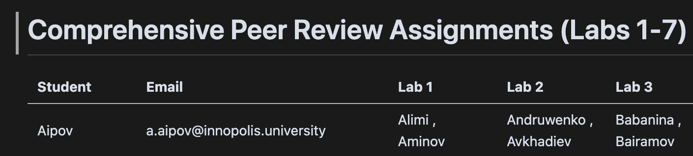
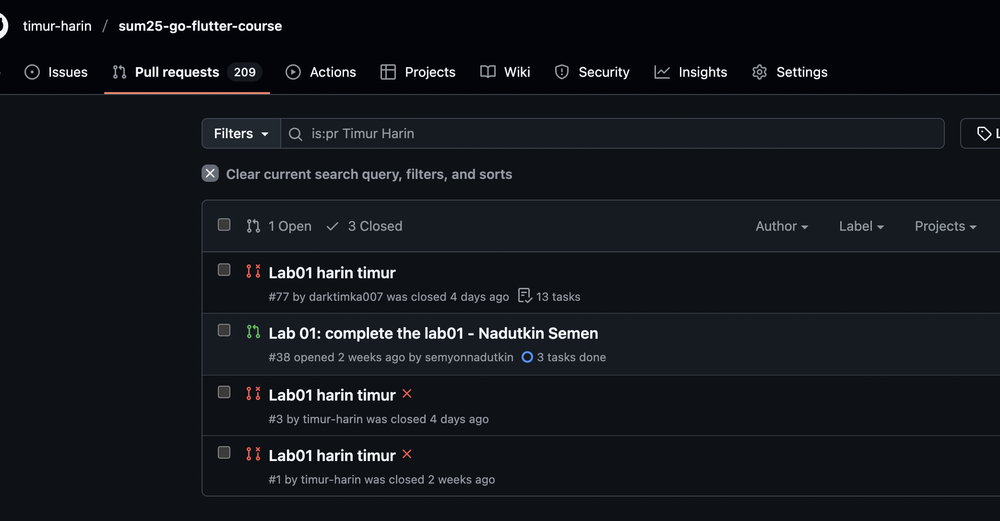
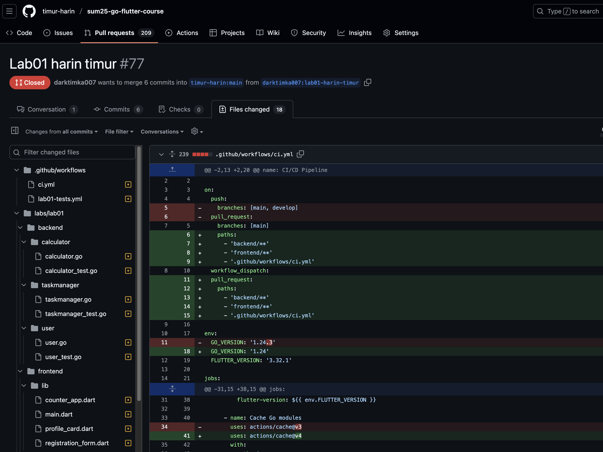
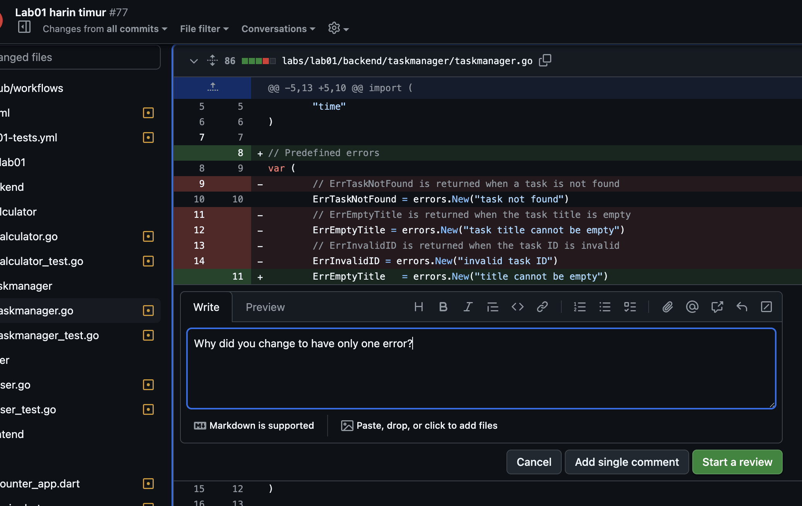
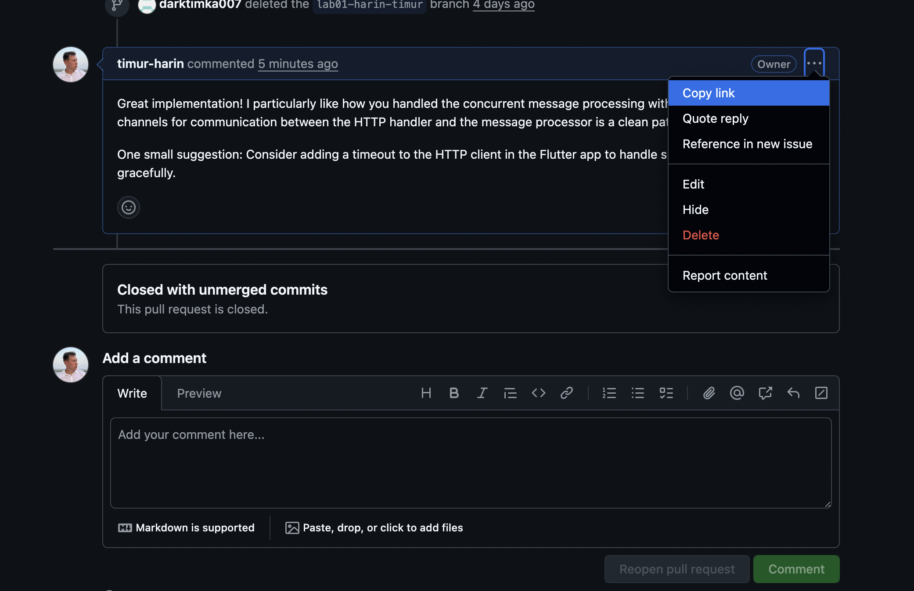

# Peer review guidelines

## 🎯 Purpose of peer review

Peer review is a crucial part of software development that helps:
- **Improve code quality** through constructive feedback
- **Share knowledge** and learn from each other's approaches
- **Catch bugs and issues** before they reach production
- **Practice professional development** workflows

## 📋 How to submit your reviews

### Step 1: Find your assigned reviews


0. Go to the [peer review assignment table](https://github.com/timur-harin/sum25-go-flutter-course/blob/main/docs/peer-review/comprehensive_peer_review_assignments.md)
1. Check the peer review assignment table for your lab
2. Find your name in the "Student" column
3. Look across the row to see which 2 students you need to review for each lab
4. Note the student names and branch names you need to review

**Example**: If you are "Aipov Artur", look for your name in the Student column, then look across the row to see:
- Lab 1: You review "Alimi Ahmed Baha Eddine" and "Aminov Amir"
- Lab 2: You review "Andruwenko Valeri" and "Avkhadiev Almir"
- And so on...

### Step 2: Locate the pull requests


1. Go to the main course repository: `https://github.com/timur-harin/sum25-go-flutter-course`
2. Click on the "Pull requests" tab
3. Look for pull requests with titles like: `Lab XX: [Description] - Lastname Firstname`
4. Find the PRs for students you're assigned to review by:
   - Searching by student name: `Lab XX: [any text] - Lastname Firstname`
   - Searching by branch name: `labXX-lastname-firstname` (e.g. `lab01-blinov-aleksandr`)
5. **If you cannot find a PR for an assigned student**, follow the "Missing PR" procedure below

### Step 3: Conduct the review


1. **Open the pull request** you need to review
2. **Read the code** thoroughly by examining the files changed
3. **Test the implementation** if possible by running the code locally
4. **Add comments** in two ways:

#### Step 3.1: Comment on specific file changes (Recommended)
1. Click on the "Files changed" tab in the PR
2. Navigate through the changed files
3. Click on the **"+"** button next to any line number to add a comment
4. Write your constructive feedback about that specific line or section
5. Click "Add single comment" to save your comment



#### Step 3.2: Add general comments to the PR
1. Scroll to the bottom of the PR page
2. Find the comment box
3. Write your overall review comments
4. Click "Comment" to submit

### Step 4: Submit review links


Submit **2 review links** to Moodle:
- Each link should point to a **GitHub comment** you made on someone's PR
- You can submit links from either:
  - Comments on specific file changes (Step 3.1 above)
  - General comments on the PR (Step 3.2 above)
- Format: `https://github.com/timur-harin/sum25-go-flutter-course/pull/77#issuecomment-3039840578`
- To get the comment link:
  1. Click on the timestamp of your comment (e.g., "2 hours ago")
  2. Copy the URL from your browser's address bar
  3. Or right-click on the comment and select "Copy link address"
- You get **1 point per valid review**

### Step 5: Handle missing pull requests
**If you cannot find a PR for an assigned student:**

1. **Search thoroughly** using these methods:
   - Search by student name: `Lab XX: [any text] - Lastname Firstname`
   - Search by branch name: `labXX-lastname-firstname` (e.g. `lab01-blinov-aleksandr`)
   - Try different variations of the student's name

2. **Document your search** in Moodle submission:
   ```
   MISSING PR REPORT:
   Student: [Full Name]
   Branch name: labXX-lastname-firstname
   Search terms used:
   - "Lab XX: - Lastname Firstname"
   - "labXX-lastname-firstname"
   - [Any other search terms you used]
   Result: No PR found
   ```

3. **You will still get points** for this review if you:
   - Document your thorough search process
   - Provide evidence that the PR truly doesn't exist
   - Complete your other assigned review(s)
   - Submit this report along with your other review links

## 🔍 What to Review

### Code Quality
- [ ] **Readability**: Is the code easy to understand?
- [ ] **Naming**: Are variables, functions, and classes well-named?
- [ ] **Structure**: Is the code organized logically?
- [ ] **Comments**: Are there helpful comments where needed?

### Functionality
- [ ] **Requirements**: Does the code meet the lab requirements?
- [ ] **Edge Cases**: Are edge cases handled properly?
- [ ] **Error Handling**: Is error handling implemented?

### Best Practices
- [ ] **Go Conventions**: Does the Go code follow Go idioms?
- [ ] **Flutter Patterns**: Does the Flutter code follow Flutter patterns?
- [ ] **API Design**: Are the APIs well-designed?

### Integration
- [ ] **Backend-Frontend**: Do the components work together?
- [ ] **Data Flow**: Is data flowing correctly between layers?
- [ ] **Error Propagation**: Are errors handled across the stack?

## 💬 How to Write Good Comments

### Positive Feedback
- **Be specific**: "Great use of goroutines for concurrent processing!"
- **Explain why**: "This error handling pattern is excellent because it provides clear user feedback"
- **Suggest improvements**: "Consider adding a timeout to this HTTP request"

### Constructive Criticism
- **Be respectful**: "I noticed a potential issue with..."
- **Provide context**: "This might cause problems because..."
- **Suggest solutions**: "Consider using X instead of Y because..."

### Questions
- **Ask for clarification**: "Could you explain why you chose this approach?"
- **Request more information**: "What happens if the API returns an error?"

## ❌ What NOT to Do

- **Don't be rude or dismissive**
- **Don't just say "good job" without specifics**
- **Don't focus only on minor formatting issues**
- **Don't ignore major problems**
- **Don't review code you don't understand without asking questions**

## ✅ Example Good Review Comments

### Positive Example
```
Great implementation! I particularly like how you handled the concurrent message processing with goroutines. The use of channels for communication between the HTTP handler and the message processor is a clean pattern.

One small suggestion: Consider adding a timeout to the HTTP client in the Flutter app to handle slow network connections gracefully.
```

### Constructive Example
```
I noticed that the error handling in the message deletion endpoint could be improved. Currently, if a message doesn't exist, it returns a 500 error, but it should return a 404 Not Found instead.

Here's a suggestion:
```go
if message == nil {
    return c.JSON(http.StatusNotFound, gin.H{"error": "Message not found"})
}
```

This would provide better API semantics and help the frontend handle the error appropriately.
```

## 📊 Review Checklist Template

Copy this template for each review:

```markdown
## Peer Review for [Student Name] - Lab [X]

### ✅ What's Working Well
- [List specific positive aspects]

### 🔧 Areas for Improvement
- [List specific issues with suggestions]

### ❓ Questions
- [List any questions about the implementation]

### 🧪 Testing Notes
- [Describe what you tested and any issues found]

### 📝 Overall Assessment
[Brief summary of the review]
```

## 🚀 Tips for effective reviews

1. **Start with the big picture**: Understand what the code is trying to accomplish
2. **Look for patterns**: Identify recurring issues or good practices
3. **Consider the user**: How will this code affect the end user?
4. **Think about maintenance**: Will this code be easy to maintain and extend?
5. **Be thorough**: Don't rush through the review

Remember: The goal is to help each other learn and improve! 🌟

## 📝 Quick Summary

### For each review assignment:
1. **Find your assignments** in the [peer review table](https://github.com/timur-harin/sum25-go-flutter-course/blob/main/docs/peer-review/comprehensive_peer_review_assignments.md)
2. **Search for PRs** using student names or branch names
3. **Review the code** by examining files changed
4. **Add comments** on specific lines (recommended) or general PR comments
5. **Copy comment links** by clicking on comment timestamps
6. **Submit 2 links** to Moodle for grading

### Comment types you can submit:
- ✅ Comments on specific file changes (line-by-line feedback)
- ✅ General comments on the PR (overall review)
- ❌ Comments on other people's comments (not counted)

### If PR not found:
- Document your search process
- Submit the missing PR report
- You still get points for thorough documentation

## 🛠 Technical details

### Branch Naming Convention
- Format: `labXX-lastname-firstname`
- Example: `lab01-blinov-aleksandr`
- All lowercase, no spaces
- Based on student's last name and first name

### Pull Request Title Format
- Format: `Lab XX: [Description] - Lastname Firstname`
- Example: `Lab 01: User Authentication with JWT - Blinov Aleksandr`

### GitHub Comment URL Format
- Base: `https://github.com/timur-harin/sum25-go-flutter-course/pull/{PR_NUMBER}#issuecomment-{COMMENT_ID}`
- Example: `https://github.com/timur-harin/sum25-go-flutter-course/pull/77#issuecomment-3039840578` 