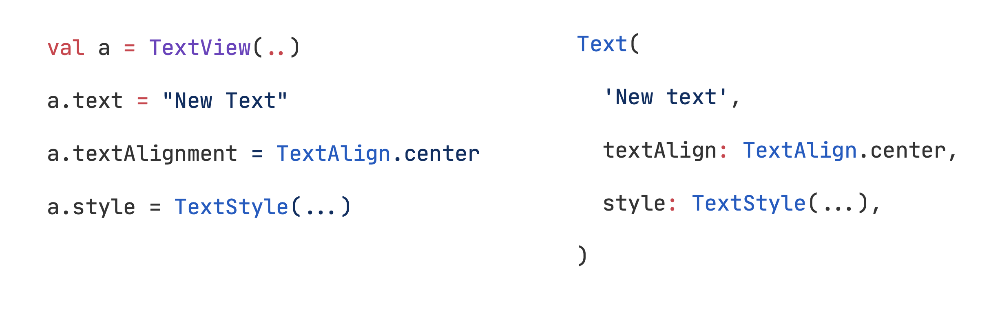

<div class="slide-title">

# Go + Flutter Course
## Rapid Cross-Platform Development

**Timur Harin**  
Lecture 01: **Foundations**

</br>

*Building the fundamentals from ground up*

</div>

---


# Block 1: Foundations

<div class="slide-content">

## Lecture 01 Overview
- **Go**: Syntax, functions, structs, packages
- **Flutter**: Widgets, layouts, UI components
- **Deep Dive**: Memory management, idioms, lifecycle

## What We'll Learn
- Step-by-step learning path (why, what, how)
- Programming fundamentals
- Language-specific concepts
- How to use with code snippets
- How it works under the hood

</div>

---

# Learning Path

<div class="slide-content">

```
Programming Basics
       |
       ├── Go Fundamentals ────────┐
       |                           |
       └── Flutter Fundamentals ───┤
                                   |
                                   ▼
                        Integration & Best Practices
```

## Progressive Learning Structure
- **Fundamentals First**: Core concepts before advanced topics
- **Parallel Tracks**: Go and Flutter developed simultaneously  
- **Integration Focus**: How technologies work together
- **Practical Application**: Real-world examples throughout

</div>

---
# Part I: Programming Fundamentals

<div class="slide-content">


#### Why Do We Need Programming Languages?

> Programming languages are **abstractions** that allow us to communicate with computers in a way that's closer to human thinking.

#### What are Frameworks?

> Frameworks are **pre-written code structures** that provide a foundation for building applications. They define the architecture and provide reusable components, allowing developers to focus on business logic rather than low-level implementation.

---

## Abstraction

<div class="slide-content">


#### Why do abstractions matter?

> **"The purpose of abstraction is not to be vague, but to create a new semantic level in which one can be absolutely precise."** - Edsger Dijkstra

> **"Abstraction is the amplification of the essential and the elimination of the irrelevant."** -  Robert C. Martin (Uncle Bob)

Abstractions allow us to:
- **Hide complexity** behind simple interfaces
- **Reuse solutions** across different problems  
- **Build incrementally** on existing work

---

## Why do we have abstraction vs performance?

<div class="slide-content">


> **The fundamental tension**: Every layer of abstraction we add makes programming easier but potentially slower and uses more resources.

#### The problem starts at hardware level:
- **CPU cycles**: Each abstraction layer adds computational overhead
- **Memory**: Higher-level languages use more RAM (garbage collection, runtime environments)
- **Direct hardware access**: Assembly is fastest, but hardest to write

#### Why we accept the trade-off:
- **Developer time > CPU time**: Programmer productivity is more expensive than hardware
- **Hardware gets faster**: Moore's law makes performance less critical over time
- **Maintainability**: Code that's easy to understand prevents bugs

</div>

---

# From Machine to Human

<div class="slide-content">

#### Evolution of programming languages
1. **Machine Code (Low-Level)**: `01001000 01100101`
2. **Assembly (Low-Level)**: `MOV AX, 5`
3. **C/C++ (Middle-Level)**: `int x = 5;`
4. **Go/Java (High-Level)**: `x := 5`
5. **Frameworks (Abstraction Layer)**: `user.Save()`

#### Why this matters
- **Productivity**: Write more with less
- **Maintainability**: Code humans can understand
- **Portability**: Write once, run anywhere

</div>

---

# Memory & Variables

<div class="slide-content">

### What are variables?
Variables are **named memory locations** that store data.

```go
// Go variable declaration
var age int = 25
name := "Alice"  // Type inference

// Memory layout (conceptual)
// Address  | Value | Variable
// 0x1000   | 25    | age
// 0x1008   | "Alice" | name
```

</div>

---

# Data Types Foundation

<div class="slide-content">

### Primitive Types
| Type | Go | Size | Example |
|------|-----|------|---------|
| Integer | `int` | 32/64 bit | `42` |
| Float | `float64` | 64 bit | `3.14` |
| String | `string` | Variable | `"Hello"` |
| Boolean | `bool` | 1 bit | `true` |

```go
var count int = 10
var price float64 = 99.99
var message string = "Hello, World!"
var isActive bool = true
```

</div>

---

# Part II: Go Language Foundations

<div class="slide-content">

## What is Go?

> Go is a **statically typed**, **compiled** programming language designed at Google for **modern software development**.

#### Why Go exists
- **Simplicity**: Easy to learn and use
- **Performance**: Compiled to native code
- **Concurrency**: Built-in support for parallel execution
- **Scalability**: Designed for large-scale systems

</div>

---

# History of Go

<div class="slide-content">

#### The Need for Go
- **2000s**: Rise of multicore processors and parallel computing
- **Problem**: Existing languages struggled with concurrency
- **C/C++**: Complex, error-prone memory management
- **Java/C#**: Heavy runtime overhead, verbose syntax

#### Birth at Google (2007-2009)
- **Creators**: Robert Griesemer, Rob Pike, Ken Thompson
- **Goal**: Simple language for modern multicore systems
- **Released**: Open source in 2009

#### Design Philosophy
- **Simplicity**: Easy to learn and maintain
- **Concurrency**: Built-in goroutines and channels
- **Performance**: Compiled, not interpreted
- **Scale**: Handle Google's massive codebases

</div>


---

# Go: The Language

<div class="slide-content">

#### Key Characteristics
- **Fast compilation** - AOT compilation
- **Garbage collection** - Automatic memory management
- **Strong typing** - Type safety
- **Built-in concurrency** - Goroutines and channels
- **Simple syntax** - 25 keywords

```go
package main

import "fmt"

func main() {
    fmt.Println("Hello, Go!")
}
```

</div>

---

# Go Package System

<div class="slide-content">

#### Understanding Packages

```
main package
    |
    ├── fmt package ──────► Standard Library
    |
    └── custom package ───► Your Code
    |
    └── third party packages ───► External libraries
```

#### Why Packages?
- **Code organization**
- **Reusability**
- **Namespace management**
- **Dependency management**

</div>

---

# Go variable declaration patterns

<div class="slide-content">

```go
// Explicit type
var name string = "Alice"

// Type inference
var age = 25

// Short declaration (inside functions)
count := 10

// Multiple variables
var (
    x int = 1
    y int = 2
)

// Zero values
var defaultInt int     // 0
var defaultString string // ""
var defaultBool bool   // false
```

</div>

---

# Go strong typing

<div class="slide-content">

```go
// This won't compile - type safety!
var age int = 25
var name string = "Alice"
// age = name  // Error: cannot assign string to int

// Explicit conversion required
var ageFloat float64 = float64(age)

// Custom types
type UserID int
type ProductID int

var user UserID = 123
var product ProductID = 456
// user = product  // Error: different types!
```

</div>

---

# Control structures (if, for, while)

<div class="slide-content">

```go
if age >= 18 { // if statement
    fmt.Println("Adult")
} else if age >= 13 {
    fmt.Println("Teenager")
} else {
    fmt.Println("Child")
}

for i := 0; i < 10; i++ { // for loop (only loop in Go!)
    fmt.Println(i)
}

count := 0 // while-like loop
for count < 5 {
    count++
}

for { // infinite loop
    break // break to exit
}
```

</div>

---

# Collections: Arrays & Slices

<div class="slide-content">

```go
// Array - fixed size
var numbers [5]int = [5]int{1, 2, 3, 4, 5}

// Slice - dynamic size
var scores []int = []int{95, 87, 92}
scores = append(scores, 88)  // Add element

// Make slice with capacity
data := make([]int, 0, 10)  // length 0, capacity 10

// Slice operations
subset := scores[1:3]  // [87, 92]
```

Memory Layout
```
Array:  [1][2][3][4][5]  (contiguous memory)
Slice:  [ptr][len][cap] -> [95][87][92][88]
```

</div>

---

# Slice internals: length and capacity

<div class="slide-content">


#### Length vs Capacity
```go
s := make([]int, 3, 5)
fmt.Println(len(s))  // 3 (current elements)
fmt.Println(cap(s))  // 5 (allocated space)

s = append(s, 1, 2)  // Still fits in capacity
fmt.Println(len(s))  // 5
fmt.Println(cap(s))  // 5

s = append(s, 3)     // Exceeds capacity!
fmt.Println(len(s))  // 6
fmt.Println(cap(s))  // 10 (doubled!)
```

</div>

---

# Slice internals: tricky moments

<div class="slide-content">

<div class="code-columns">
<div>

```go
// 1. Slice sharing underlying array
a := []int{1, 2, 3, 4, 5}
b := a[1:3]  // [2, 3]
b[0] = 99    // Modifies original!
fmt.Println(a)  // [1, 99, 3, 4, 5]

// 2. Append can reallocate
original := []int{1, 2, 3}
slice1 := original[:2]  // [1, 2]
slice2 := append(slice1, 99)  // May reallocate
// slice1 and slice2 might point to different arrays!

```
</div>

<div>


```go
// 3. Zero-value slice is usable
var s []int         // nil slice (len=0, cap=0)
fmt.Println(s == nil)  // true
s = append(s, 1)    // append works on nil slices!
fmt.Println(s)      // [1]
fmt.Println(len(s)) // 1
fmt.Println(cap(s)) // 1 (Go allocates automatically)

// This is unique to slices - maps need make()
var m map[string]int  // nil map
// m["key"] = 1       // This would panic!
m = make(map[string]int)  // Must initialize first
```
</div>

</div>
</div>

---

# Best practices for slices

<div class="slide-content">

#### Best practices
- **Pre-allocate capacity** when you know the approximate size: `make([]int, 0, expectedSize)`
- **Use copy()** when you need independent slices: `copy(dst, src)`
- **Be careful with sub-slices** - they share the underlying array
- **Check capacity** before performance-critical operations
- **Prefer `s = s[:0]` over `s = nil`** to reuse allocated memory
- **Use `append()` with `...` operator** for slice concatenation: `append(slice1, slice2...)`
- **Avoid memory leaks** with large slices - use `copy()` to extract small portions
- **Initialize with literal syntax** when contents are known: `[]int{1, 2, 3}`

#### Common pitfalls to avoid
- Don't rely on slice capacity after passing to functions
- Be aware that `range` copies values, not references
- Remember that empty slice `[]int{}` ≠ nil slice `[]int(nil)`

</div>

---

# Maps: Key-Value Storage (hash tables)

<div class="slide-content">

```go
// Map declaration
var ages map[string]int = make(map[string]int)

// Map literal
userAges := map[string]int{
    "Alice": 25,
    "Bob":   30,
    "Carol": 28,
}

// Operations
userAges["David"] = 22        // Add
age, exists := userAges["Alice"]  // Read with existence check
delete(userAges, "Bob")       // Delete

// Iterate
for name, age := range userAges {
    fmt.Printf("%s is %d years old\n", name, age)
}
```

</div>

---

# Functions: Building blocks

<div class="slide-content">

<div class="code-columns">
<div>

```go
// Basic function
func greet(name string) string {
    return "Hello, " + name
}

// Multiple return values
func divide(a, b float64) (float64, error) {
    if b == 0 {
        return 0, fmt.Errorf("division by zero")
    }
    return a / b, nil
}


```
</div>

<div>

```go 
// Void functions
func printMessage(message string) {
    fmt.Println(message)
}

// Named return values
func calculate(x, y int) (sum, diff int) {
    sum = x + y
    diff = x - y
    return  // implicit return
}
```

</div>

</div>

</div>


---

# Functions: Advanced Patterns

<div class="slide-content">

```go
// Function as parameter
func apply(nums []int, fn func(int) int) []int {
    result := make([]int, len(nums))
    for i, num := range nums {
        result[i] = fn(num)
    }
    return result
}

// Usage
double := func(x int) int { return x * 2 }
numbers := []int{1, 2, 3, 4, 5}
doubled := apply(numbers, double)  // [2, 4, 6, 8, 10]

// Anonymous functions
squares := apply(numbers, func(x int) int {
    return x * x
})
```

</div>

---

# Structs: Custom Types

<div class="slide-content">

<div class="code-columns">
<div>

```go
// Struct definition
type Person struct {
    Name    string
    Age     int
    Email   string
    Address Address  // Embedded struct
}

type Address struct {
    Street  string
    City    string
    Country string
}
```

</div>

<div>

```go
// Creating instances
p1 := Person{
    Name:  "Alice",
    Age:   25,
    Email: "alice@example.com",
    Address: Address{
        Street:  "123 Main St",
        City:    "Boston",
        Country: "USA",
    },
}
```

</div>

</div>


</div>

---

# Methods: Behavior + Data

<div class="slide-content">

<div class="code-columns">
<div>

```go
// Method with value receiver
func (p Person) GetFullName() string {
    return p.Name
}

// Method with pointer receiver (can modify)
func (p *Person) UpdateAge(newAge int) {
    p.Age = newAge
}

```
</div>

<div>

```go
// Method usage
person := Person{Name: "Bob", Age: 30}
fmt.Println(person.GetFullName())  // "Bob"

person.UpdateAge(31)
fmt.Println(person.Age)  // 31
```

</div>

</div>

</div>

---

# Value vs Pointer Receivers

<div class="slide-content">

<div class="code-columns">
<div>

#### Value Receiver (Copy)
```go
type Counter struct {
    count int
}

// Value receiver - works on a COPY
func (c Counter) IncrementValue() {
    c.count++  // Only modifies the copy!
    fmt.Printf("Inside method: %d\n", c.count)
}

// Usage
counter := Counter{count: 5}
counter.IncrementValue()  // Inside method: 6
fmt.Printf("Original: %d\n", counter.count)  // Original: 5

// The original is unchanged!
```

</div>
<div>

#### Pointer Receiver (Reference)
```go
type Counter struct {
    count int
}

// Pointer receiver - works on ORIGINAL
func (c *Counter) IncrementPointer() {
    c.count++  // Modifies the original!
    fmt.Printf("Inside method: %d\n", c.count)
}

// Usage
counter := Counter{count: 5}
counter.IncrementPointer()  // Inside method: 6
fmt.Printf("Original: %d\n", counter.count)  // Original: 6

// The original is modified!
```

</div>
</div>

</div>

---

# Key differences between value and pointer receivers

<div class="slide-content">

<div class="code-columns">
<div>

#### Key Differences
- **Value Receiver**: Gets a **copy** of the struct - cannot modify original
- **Pointer Receiver**: Gets a **reference** to the struct - can modify original
- **Performance**: Pointer receivers avoid copying large structs
- **Consistency**: If any method needs to modify, use pointer receivers for all methods


</div>

<div>


#### When to Use Which?
- **Use Value Receivers**: For small structs, read-only operations, immutable types
- **Use Pointer Receivers**: When you need to modify the struct, large structs, or consistency

</div>

</div>

</div>

---

# Interfaces: Contracts

<div class="slide-content">

```go
// Interface definition
type Writer interface {
    Write([]byte) (int, error)
}

type Printer interface {
    Print() string
}

// Implement interface (implicit)
type ConsoleWriter struct{}

func (cw ConsoleWriter) Write(data []byte) (int, error) {
    fmt.Print(string(data))
    return len(data), nil
}

// Usage
var w Writer = ConsoleWriter{}
w.Write([]byte("Hello, World!"))
```

</div>


---

# Structuring Go projects

<div class="slide-content">


<div class="code-columns">
<div>

```
myproject/
├── cmd/
│   └── main.go
├── internal/
│   ├── models/
│   │   ├── user.go
│   │   └── product.go
├── | - handlers/
│   │   ├── user_handler.go
│   │   └── product_handler.go
├── | - utils/
│   │   └── validation.go
    └── validation.go
```

</div>

<div>


```go
// internal/models/user.go
package models

type User struct {
    ID    int    `json:"id"`
    Name  string `json:"name"`
    Email string `json:"email"`
}

// internal/handlers/user_handler.go
package handlers

import "myproject/models"

func CreateUser(user models.User) error {
    // Implementation
    return nil
}
```

</div>

</div>

</div>


---

# Memory Management in Go

<div class="slide-content">


```
Stack Memory                    Heap Memory
     |                               |
     ├── Local Variables             ├── Dynamic Allocations
     |                               |
     └── Function Parameters         └── Garbage Collector
                                             |
                                             └── Mark & Sweep
```

## Stack vs Heap
- **Stack**: Fast, automatic cleanup, limited size
- **Heap**: Flexible size, garbage collected, slower

</div>

---

# Go Idioms & Best Practices
 
<div class="slide-content">

<div class="code-columns">
<div>

#### Error Wrapping

```go
// Layer 1: Low-level function
func readConfig(path string) (*Config, error) {
    data, err := os.ReadFile(path)
    if err != nil {
        return nil, errors.Wrap(err, "os.ReadFile")
    }
    return parseConfig(data)
}

// Layer 2: Higher-level function
func initializeApp() error {
    _, err := readConfig("/etc/app.conf")
    if err != nil {
        return errors.Wrap(err, "readConfig in initializeApp")
    }
    return nil
}
```

</div>

<div>


#### Error Inspection
```go
err := initializeApp()
if err != nil {
    if errors.Is(err, os.ErrNotExist) {     // Check for specific error types
        log.Println("Config file missing")
    }
    
    var pathErr *os.PathError // Get the root cause
    if errors.As(err, &pathErr) {
        log.Printf("Path error: %s", pathErr.Path)
    }
    
    log.Printf("Full error: %v", err)
    // Output: failed to initialize app: 
    // reading config file: open /etc/app.conf: no such file or directory
}
```


#### Zero Values Pattern
```go
var user User  // Zero value is ready to use
user.Name = "Alice"  // No need for constructors
```

</div>

</div>

</div>


---

# Part III: Flutter Foundations

<div class="slide-content">

## What is Flutter?

> Flutter is Google's **UI toolkit** for building **natively compiled** applications for mobile, web, and desktop from a **single codebase**.

## Why Flutter Exists
- **Cross-platform**: One code, multiple platforms
- **Performance**: Compiled to native code
- **Hot Reload**: Fast development cycle
- **Expressive UI**: Rich widget system

</div>

---

# Flutter Architecture

<div class="slide-content">

<div class="code-columns">
<div>

#### How Flutter Works

```
Dart Code
    |
    ▼
Flutter Framework
    |
    ▼
Flutter Engine
    |
    ▼
Platform Specific
    |
    ├── iOS
    ├── Android
    ├── Web
    └── Desktop
```

</div>

<div>

## Key Components
- **Dart Language**: Programming language
- **Flutter Framework**: Widget system
- **Flutter Engine**: Rendering engine
- **Platform Embedder**: Platform integration


</div>

</div>

</div>


---

# Everything is a Widget

<div class="slide-content">

<div class="code-columns">
<div>

## Widget Philosophy

In Flutter, **everything is a widget**:
- Text is a widget
- Buttons are widgets
- Layout containers are widgets
- Even your app is a widget!


```dart
class MyApp extends StatelessWidget {
  @override
  Widget build(BuildContext context) {
    return MaterialApp(
      home: Text('Hello, Flutter!'),
    );
  }
}
```

</div>

<div>

<div class="image-container" >


</div>

</div>

</div>

</div>


---

# Dart Entry Point

<div class="slide-content">

```dart
void main() {
  print('Hello, Dart!');
}
```

- Every Dart app starts with `main()`
- Use `void main(List<String> args)` to access CLI arguments

</div>

---

# Dart Data Types

<div class="slide-content">

| Type     | Example                  | Notes                      |
|----------|--------------------------|----------------------------|
| `int`    | `int age = 30;`          | Whole numbers              |
| `double` | `double pi = 3.14;`      | 64-bit floating point      |
| `String` | `String name = 'Alice';` | UTF-16 text                |
| `bool`   | `bool ready = true;`     | `true` / `false`           |
| `List`   | `var nums = [1, 2, 3];`  | Ordered collection         |
| `Map`    | `var user = {'id':1};`   | Key-value store            |

```dart
var temperature = 36.6;   // double inferred
const url = 'https://api.dev';
```

</div>

---

# Methods of Core Types

<div class="slide-content">

<div class="code-columns">
<div>

### String Utilities

```dart
var text = 'Flutter';
print(text.toUpperCase());      // FLUTTER
print(text.substring(0, 3));    // Flu
print(text.contains('tt'));     // true
print(text.replaceAll('t', 'T'));// FluTTer
```

</div>
<div>

### List Operations

```dart
var nums = [1, 2, 3];
nums.add(4);                    // [1,2,3,4]
nums.removeAt(0);               // [2,3,4]
var doubled = nums.map((n) => n * 2).toList();
print(doubled);                 // [4,6,8]
```

</div>
</div>

<div class="code-columns">
<div>

### Map Helpers

```dart
var user = {'id': 1, 'name': 'Alice'};
print(user.keys);               // (id, name)
print(user.values);             // (1, Alice)
user.update('name', (v) => 'Bob');
print(user);                    // {id:1, name:Bob}
```

</div>
<div>

### Type Conversion

```dart
var s = '42';
int num = int.parse(s);         // 42
print(num.toString());          // '42'
```

</div>
</div>

</div>

---

# Type System in Dart

<div class="slide-content">

| Keyword | Meaning | Mutability | Example |
|---------|---------|------------|---------|
| `dynamic` | Type resolved **at runtime** | Variable **can change type & value** | `dynamic x = 1; x = 'hi';` |
| `final` | Single assignment at **runtime** | Value cannot change after first set | `final date = DateTime.now();` |
| `const` | Compile-time constant | Immutable & allocated once | `const pi = 3.1415;` |

```dart
var a = 10;          // type inferred (int), mutable
final b = 20;        // cannot be reassigned
const c = 30;        // compile-time constant
dynamic d = 'text';  // can later become int
```

- Use **`dynamic`** sparingly—loses type safety.
- Choose **`final`** for values calculated once (API responses, DateTime).
- Use **`const`** when value is known at compile time (numbers, strings, ...).

</div>

---

# Null Safety

<div class="slide-content">

Dart is **null-safe** by default.

```dart
String? name;          // Nullable variable
name = null;           // OK

String nick = 'Tim';
// nick = null;        // Compile-time error

int? len = name?.length;  // Safe navigation
print(len ?? 0);          // Default value with ??
```

Key operators:
- `?`  nullable type
- `!`  non-null assertion
- `??` default value
- `??=` assign if null

</div>

---

# Control Flow

<div class="slide-content">

<div class="code-columns">
<div>

### if / else

```dart
if (age >= 18) {
  print('Adult');
} else if (age >= 13) {
  print('Teen');
} else {
  print('Child');
}
```

</div>
<div>

### switch

```dart
switch (day) {
  case 1:
    print('Mon');
    break;
  case 2:
    print('Tue');
    break;
  default:
    print('Weekend');
}
```

</div>
</div>

</div>

---

# Ternary & Default Operators

<div class="slide-content">

```dart
var status = score >= 50 ? 'Pass' : 'Fail'; // Ternary

String? title;
var pageTitle = title ?? 'Untitled';         // Default operator

title ??= 'New Title'; // Assign only if null
```

These concise operators reduce boilerplate in conditional logic.

</div>

---

# Functions in Dart

<div class="slide-content">

<div class="code-columns">
<div>

```dart
// Regular function
String greet(String name) {
  return 'Hello, $name!';
}

// Arrow syntax for single expressions
int add(int a, int b) => a + b;

// Optional positional parameters []
String sayHi(String name, [String? title]) {
  return title != null ? 'Hi $title $name' : 'Hi $name';
}

void printPerson({ // Named parameters {}
  required String name,  // required parameter
  int? age,             // optional parameter
  String country = 'US' // default value
}) {
  print('$name, ${age ?? 'unknown'} years, $country');
}
```

</div>
<div>

```dart
// Function with function parameter
void execute(void Function() callback) {
  callback();
}

// Generic function
T transform<T>(T value, T Function(T) transformer) {
  return transformer(value);
}

// Anonymous functions
final multiply = (int x, int y) => x * y;

Function counter() { // Closure example
  int count = 0;
  return () {
    count++;
    return count;
  };
}
```

</div>

</div>

</div>

---

# Function Types

<div class="slide-content">

<div class="code-columns">
<div>

```dart
// Typedef for function type
typedef Operation = int Function(int, int);
Operation add = (a, b) => a + b;


void main() {
  // Basic function calls
  print(greet('Alice'));               // Hello, Alice!
  print(add(5, 3));                   // 8
  
  // Optional parameters
  print(sayHi('Bob'));                // Hi Bob
  print(sayHi('Bob', 'Mr.'));         // Hi Mr. Bob
  
  printPerson(  // Named parameters
    name: 'Carol',
    age: 25,
    country: 'UK'
  );                                  // Carol, 25 years, UK
  
  execute(() => print('Executed!'));   // Function as parameter
}
```

</div>

<div>

```dart
  print(transform<int>(5, (x) => x * 2));  // Generic function - 10

  final count = counter();   // Closure usage
  print(count());                     // 1 
  print(count());                     // 2
```

Key Points:
- Use `[]` for optional positional parameters
- Use `{}` for named parameters
- Mark required named parameters with `required`
- Provide default values with `=`
- Use `typedef` for function type aliases
- Functions are first-class citizens (can be passed as arguments)
- Closures capture variables from their scope

</div>

</div>


</div>


---

# Classes & Constructors

<div class="slide-content">

```dart
class User {
  final int id;
  String name;

  // Default constructor
  User(this.id, {required this.name});

  // Named constructor
  User.guest() : id = 0, name = 'Guest';

  void greet() => print('Hi, $name');
}

var u1 = User(1, name: 'Alice');
var guest = User.guest();
// What is the output?
```

</div>

---

# Inheritance, Interfaces & Mixins

<div class="slide-content">

<div class="code-columns">
<div>

```dart
class Animal {
  void walk() => print('Walking');
}

class Dog extends Animal {
  @override
  void walk() => print('Dog walking');
}

abstract class Logger {
  void log(String msg);
}

```
</div>

<div>

```dart 
class ConsoleLogger implements Logger {
  @override
  void log(String msg) => print(msg);
}

mixin Swimmer {
  void swim() => print('Swimming');
}

class Duck extends Animal with Swimmer {}
```

- `extends` for single inheritance
- `implements` enforces an interface
- `mixin` (with `with`) shares behavior

</div>
</div>
</div>

---

# Overriding & Polymorphism

<div class="slide-content">

```dart
class Shape {
  double area() => 0;
}

class Circle extends Shape {
  final double r;
  Circle(this.r);

  @override
  double area() => 3.14 * r * r;
}

void printArea(Shape s) => print(s.area());

printArea(Circle(10));
```

</div>

---

# Imperative vs Declarative

<div class="slide-content">

| Style        | Idea                               | Flutter Angle                         |
|--------------|------------------------------------|---------------------------------------|
| Imperative   | Describe **how** to make changes   | Directly mutating UI widgets (rare)   |
| Declarative  | Describe **what** UI should be     | Return widgets from `build()` method  |

Flutter is declarative: UI is rebuilt from state → widgets, framework handles diffing.

<div class="image-container">



</div>

</div>

---

# Core Widgets

<div class="slide-content">

- Display: `Text`, `Icon`, `Image`
- Container & styling: `Container`, `Padding`, `Center`, `SizedBox`
- Layout: `Row`, `Column`, `Stack`, `Expanded`, `Flexible`
- Scrollables: `SingleChildScrollView`, `ListView`, `GridView`
- Buttons: `ElevatedButton`, `TextButton`, `OutlinedButton`, `IconButton`
- Input: `TextField`, `Checkbox`, `Switch`, `Slider`

```dart
Column(
  children: const [
    Text('Hello'),
    ElevatedButton(onPressed: null, child: Text('Click')),
  ],
)
```

</div>

---

# Layout Widgets Deep Dive

<div class="slide-content">

<div class="code-columns">
<div>

### Flex-based

```dart
Row(
  mainAxisAlignment: MainAxisAlignment.spaceAround,
  children: const [Icon(Icons.home), Icon(Icons.settings)],
)
```

```dart
Column(
  crossAxisAlignment: CrossAxisAlignment.start,
  children: const [Text('A'), Text('B')],
)
```

</div>
<div>

### Stack & Positioned

```dart
Stack(
  children: [
    Image.asset('bg.png'),
    Positioned(
      bottom: 20,
      right: 20,
      child: Text('Watermark'),
    ),
  ],
)
```

</div>
</div>

</div>

---

# Widget Tree Structure

<div class="slide-content">

<div class="code-columns">
<div>

### Hierarchical Composition

```
MaterialApp
    |
    └── Scaffold
            |
            ├── AppBar
            |
            └── Body: Column
                    |
                    ├── Text Widget
                    ├── Button Widget
                    └── Container Widget
                            |
                            └── Child: Text
```

</div>

<div>

### Widget Composition

```dart
Widget build(BuildContext context) {
  return Scaffold(
    appBar: AppBar(title: Text('My App')),
    body: Column(
      children: [
        Text('Welcome!'),
        ElevatedButton(
          onPressed: () {},
          child: Text('Click Me'),
        ),
      ],
    ),
  );
}
```

</div>

</div>

</div>


---

# Stateless vs Stateful Widgets

<div class="slide-content">

<div class="code-columns">
<div>

### Stateless Widgets

```dart
class WelcomeScreen extends StatelessWidget {
  final String userName;
  
  WelcomeScreen({required this.userName});
  
  @override
  Widget build(BuildContext context) {
    return Scaffold(
      body: Center(
        child: Text('Welcome, $userName!'),
      ),
    );
  }
}
```

</div>

<div>


**Characteristics:**
- Immutable
- No internal state
- Rebuilds only when parent changes

</div>

</div>

</div>


---

# Stateful Widgets

<div class="slide-content">

<div class="code-columns">
<div>

### Managing State

```dart
class Counter extends StatefulWidget {
  @override
  _CounterState createState() => _CounterState();
}

class _CounterState extends State<Counter> {
  int _count = 0;
  
  void _increment() {
    setState(() {
      _count++;
    });
  }
  

```

</div>

<div>

**Characteristics:**
- Mutable
- Internal state
- Rebuilds when state changes


```dart
 @override
  Widget build(BuildContext context) {
    return Column(
      children: [
        Text('Count: $_count'),
        ElevatedButton(
          onPressed: _increment,
          child: Text('Increment'),
        ),
      ],
    );
  }
}
```


</div>

</div>

</div>


---

# Widget Lifecycle (StatefulWidget)

<div class="slide-content">

<div class="code-columns">
<div>


```
createState
    |
    ▼
initState
    |
    ▼
didChangeDependencies
    |
    ▼
build ◄──────────────┐
    |                |
    ▼                |
setState called? ────┘
    |
    ▼ (No)
didUpdateWidget
    |
    ▼
deactivate
    |
    ▼
dispose
```

</div>

<div>

```dart
class LifecycleDemo extends StatefulWidget {
  @override
  _LifecycleDemoState createState() => _LifecycleDemoState();
}
class _LifecycleDemoState extends State<LifecycleDemo> {
  @override
  void initState() {
    super.initState();
    print('Widget initialized');
  }
  
  @override
  void didChangeDependencies() {
    super.didChangeDependencies();
    print('Dependencies changed');
  }
  
  @override
  Widget build(BuildContext context) {
    print('Building widget');
    return Container();
  }
  
  @override
  void dispose() {
    print('Widget disposed');
    super.dispose();
  }}
```

</div>

</div>

</div>


---

# Basic UI Components (Essential Widgets)

<div class="slide-content">

<div class="code-columns">
<div>

```dart
class BasicWidgets extends StatelessWidget {
  @override
  Widget build(BuildContext context) {
    return Scaffold(
      appBar: AppBar(title: Text('Basic Widgets')),
      body: Column(
        children: [
          Text('Simple text'),
          Text(
            'Styled text',
            style: TextStyle(
              fontSize: 20,
              fontWeight: FontWeight.bold,
              color: Colors.blue,
            ),
          ),
          ElevatedButton(
            onPressed: () => print('Elevated button pressed'),
            child: Text('Elevated Button'),
          ),
```

</div>

<div>

```dart
          TextButton(
            onPressed: () => print('Text button pressed'),
            child: Text('Text Button'),
          ),
          
          TextField(
            decoration: InputDecoration(
              labelText: 'Enter your name',
              border: OutlineInputBorder(),
            ),
          ),
        ],
      ),
    );
  }
}
```

</div>

</div>

</div>


---

# Layout Widgets

## Organizing Your UI

<div class="code-columns">
<div>

### Row (Horizontal)
```dart
Row(
  mainAxisAlignment: 
    MainAxisAlignment.spaceEvenly,
  children: [
    Icon(Icons.home),
    Icon(Icons.search),
    Icon(Icons.settings),
  ],
)
```

</div>
<div>

### Column (Vertical)
```dart
Column(
  crossAxisAlignment: 
    CrossAxisAlignment.start,
  children: [
    Text('Title'),
    Text('Subtitle'),
    Text('Description'),
  ],
)
```

</div>
</div>

---

# Container & Padding

<div class="slide-content">

<div class="code-columns">
<div>

```dart
Container(
  width: 200,
  height: 100,
  padding: EdgeInsets.all(16),
  margin: EdgeInsets.symmetric(vertical: 8),
  decoration: BoxDecoration(
    color: Colors.blue,
    borderRadius: BorderRadius.circular(12),
    boxShadow: [
      BoxShadow(
        color: Colors.grey.withOpacity(0.5),
        spreadRadius: 2,
        blurRadius: 4,
        offset: Offset(0, 2),
      ),
    ],
  ),
```

</div>

<div>

```dart
  child: Center(
    child: Text(
      'Styled Container',
      style: TextStyle(color: Colors.white),
    ),
  ),
)
```

</div>

</div>

</div>


---

# Scrollable Widgets

<div class="slide-content">

<div class="code-columns">
<div>


```dart
class ScrollableExample extends StatelessWidget {
  @override
  Widget build(BuildContext context) {
    return Scaffold(
      body: ListView.builder(
        itemCount: 100,
        itemBuilder: (context, index) {
          return ListTile(
            leading: CircleAvatar(
              child: Text('${index + 1}'),
            ),
```

</div>

<div>

```dart
            title: Text('Item $index'),
            subtitle: Text('Description for item $index'),
            trailing: Icon(Icons.arrow_forward_ios),
            onTap: () {
              print('Tapped item $index');
            },
          );
        },
      ),
    );
  }
}
```

</div>

</div>

</div>


---

# Alignment & Positioning

<div class="slide-content">

<div class="code-columns">
<div>


```dart
class AlignmentExample extends StatelessWidget {
  @override
  Widget build(BuildContext context) {
    return Scaffold(
      body: Stack(
        children: [
          // Background
          Container(color: Colors.grey[200]),
          
          // Centered content
          Center(
            child: Text('Centered'),
          ),
```

</div>

<div>

```dart
          // Positioned widgets
          Positioned(
            top: 50,
            right: 20,
            child: Icon(Icons.notifications),
          ),
          
          Positioned(
            bottom: 20,
            left: 20,
            right: 20,
            child: ElevatedButton(
              onPressed: () {},
              child: Text('Bottom Button'),
            ),
          ),
        ],
      ),
    );
  }
}
```

</div>

</div>

</div>


---

# Styling & Theming

<div class="slide-content">

<div class="code-columns">
<div>


```dart
class MyApp extends StatelessWidget {
  @override
  Widget build(BuildContext context) {
    return MaterialApp(
      theme: ThemeData(
        primarySwatch: Colors.blue,
        textTheme: TextTheme(
          headline1: TextStyle(
            fontSize: 32,
            fontWeight: FontWeight.bold,
          ),
          bodyText1: TextStyle(
            fontSize: 16,
            color: Colors.grey[800],
          ),
```

</div>

<div>

```dart
        elevatedButtonTheme: ElevatedButtonThemeData(
          style: ElevatedButton.styleFrom(
            backgroundColor: Colors.blue,
            foregroundColor: Colors.white,
            shape: RoundedRectangleBorder(
              borderRadius: BorderRadius.circular(8),
            ),
          ),
        ),
      ),
      home: HomeScreen(),
    );
  }
}
```

</div>

</div>

</div>


---

# State Management Basics

<div class="slide-content">

<div class="code-columns">
<div>


```dart
class TodoApp extends StatefulWidget {
  @override
  _TodoAppState createState() => _TodoAppState();
}

class _TodoAppState extends State<TodoApp> {
  List<String> _todos = [];
  TextEditingController _controller = TextEditingController();
  
  void _addTodo() {
    if (_controller.text.isNotEmpty) {
      setState(() {
        _todos.add(_controller.text);
        _controller.clear();
      });
    }
  }
  
  void _removeTodo(int index) {
    setState(() {
      _todos.removeAt(index);
    });
  }
```

</div>

<div>

```dart
  @override
  Widget build(BuildContext context) {
    return Scaffold(
      appBar: AppBar(title: Text('Todo App')),
      body: Column(
        children: [
          Padding(
            padding: EdgeInsets.all(16),
            child: Row(
              children: [
                Expanded(
                  child: TextField(
                    controller: _controller,
                    decoration: InputDecoration(
                      hintText: 'Enter a todo',
                    ),
                  ),
                ),
                IconButton(
                  onPressed: _addTodo,
                  icon: Icon(Icons.add),
                ),
              ],
            ),
          ),
```

</div>

<div>

```dart
          Expanded(
            child: ListView.builder(
              itemCount: _todos.length,
              itemBuilder: (context, index) {
                return ListTile(
                  title: Text(_todos[index]),
                  trailing: IconButton(
                    onPressed: () => _removeTodo(index),
                    icon: Icon(Icons.delete),
                  ),
                );
              },
            ),
          ),
        ],
      ),
    );
  }
  
  @override
  void dispose() {
    _controller.dispose();
    super.dispose();
  }
}
```

</div>

</div>

</div>


---

# Input Handling & Forms

<div class="slide-content">

<div class="code-columns">
<div>


```dart
class UserForm extends StatefulWidget {
  @override
  _UserFormState createState() => _UserFormState();
}

class _UserFormState extends State<UserForm> {
  final _formKey = GlobalKey<FormState>();
  String _name = '';
  String _email = '';
  
  @override
  Widget build(BuildContext context) {
    return Scaffold(
      appBar: AppBar(title: Text('User Form')),
      body: Padding(
        padding: EdgeInsets.all(16),
        child: Form(
          key: _formKey,
          child: Column(
            children: [
              TextFormField(
                decoration: InputDecoration(labelText: 'Name'),
                validator: (value) {
                  if (value == null || value.isEmpty) {
                    return 'Please enter your name';
                  }
                  return null;
                },
                onSaved: (value) => _name = value!,
              ),
```

</div>

<div>

```dart
              TextFormField(
                decoration: InputDecoration(labelText: 'Email'),
                validator: (value) {
                  if (value == null || !value.contains('@')) {
                    return 'Please enter a valid email';
                  }
                  return null;
                },
                onSaved: (value) => _email = value!,
              ),
              SizedBox(height: 20),
              ElevatedButton(
                onPressed: () {
                  if (_formKey.currentState!.validate()) {
                    _formKey.currentState!.save();
                    print('Name: $_name, Email: $_email');
                  }
                },
                child: Text('Submit'),
              ),],),),),);}
  }
```

</div>

</div>

</div>


---

# Complete Example: Weather App

<div class="slide-content">

<div class="code-columns">
<div>


```dart
class WeatherApp extends StatefulWidget {
  @override
  _WeatherAppState createState() => _WeatherAppState();
}

class _WeatherAppState extends State<WeatherApp> {
  String _city = 'New York';
  int _temperature = 22;
  String _condition = 'Sunny';
  
  @override
  Widget build(BuildContext context) {
    return MaterialApp(
      title: 'Weather App',
      theme: ThemeData(
        primarySwatch: Colors.blue,
        visualDensity: 
        VisualDensity.adaptivePlatformDensity,
      ),
      home: Scaffold(
        appBar: AppBar(
          title: Text('Weather App'),
          backgroundColor: Colors.blue[700],
        ),
```

</div>

<div>

```dart
        body: Container(
          decoration: BoxDecoration(
            gradient: LinearGradient(
              begin: Alignment.topCenter,
              end: Alignment.bottomCenter,
              colors: [Colors.blue[400]!, Colors.blue[800]!],
            ),
          ),
          child: Center(
            child: Column(
              mainAxisAlignment: MainAxisAlignment.center,
              children: [
                Icon(
                  Icons.wb_sunny,
                  size: 100,
                  color: Colors.yellow,
                ),
                SizedBox(height: 20),
                Text(
                  _city,
                  style: TextStyle(
                    fontSize: 32,
                    color: Colors.white,
                    fontWeight: FontWeight.bold,
                  ),
                ),
```

</div>

<div>

```dart
                SizedBox(height: 10),
                Text(
                  '$_temperature°C',
                  style: TextStyle(
                    fontSize: 48,
                    color: Colors.white,
                    fontWeight: FontWeight.w300,
                  ),
                ),
                Text(
                  _condition,
                  style: TextStyle(
                    fontSize: 20,
                    color: Colors.white70,
                  ),
                ),
                SizedBox(height: 40),
                ElevatedButton(
                  onPressed: () {
                    setState(() {
                      _temperature = 18 + (30 - 18) * 
                      (DateTime.now().millisecond / 1000);
                    });
                  },
                  child: Text('Refresh'),
                  style: ElevatedButton.styleFrom(
                    backgroundColor: Colors.white,
                    foregroundColor: Colors.blue[700],
                    padding: EdgeInsets.symmetric(horizontal: 30, vertical: 15),
                  ),),],),),),),);}
  }
```

</div>

</div>

</div>


---

# What We've Learned

<div class="slide-content">

<div>


### Go Fundamentals
- **Type system**: Strong, static typing
- **Memory management**: Garbage collection
- **Concurrency**: Goroutines (next lecture)
- **Simplicity**: Clear, readable syntax

### Flutter Fundamentals
- **Widget-based**: Everything is a widget
- **Declarative**: Describe what you want
- **Hot reload**: Fast development
- **Cross-platform**: One codebase, multiple targets

</div>

---

# Best Practices Summary

<div class="slide-content">
<div>

### Go Best Practices
- **Error handling**: Always check errors
- **Package organization**: Clear, logical structure
- **Naming**: Descriptive, consistent names
- **Simplicity**: Prefer clear over clever

### Flutter Best Practices
- **Widget composition**: Small, reusable widgets
- **State management**: Keep state local when possible
- **Performance**: Use const constructors
- **Responsive design**: Adapt to different screen sizes

</div>


---

# Thank You!

<div class="slide-content">

<div class="code-columns">
<div>

**Resources:**
- Go Documentation: https://golang.org/doc/
- Flutter Documentation: https://flutter.dev/docs
- Course Repository: https://github.com/timur-harin/sum25-go-flutter-course

**Contact:**
- Email: timur.harin@mail.com
- Telegram: @timur_harin

**Next Lecture:** Concurrency & Streams

# Questions?


</div>
</div>
