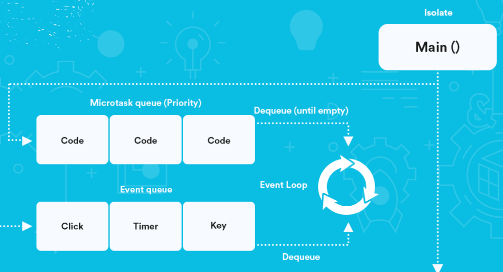
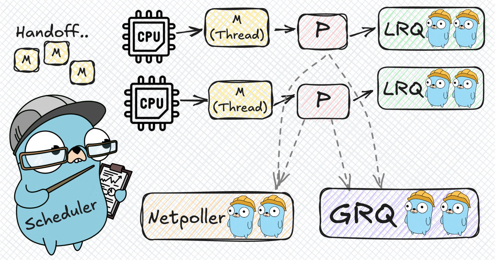

<div class="slide-title">

# Go + Flutter Course
## Concurrency & Streams

**Timur Harin**  
Lecture 02: **Concurrency & Streams**

</br>

*Mastering asynchronous programming in both worlds*

</div>

---

# Block 2: Concurrency & Streams

<div class="slide-content">

## Lecture 02 Overview
- **Go Concurrency**: Goroutines, channels, scheduler
- **Flutter Async**: Event loop, async/await, streams
- **Integration**: How they communicate

## What we'll learn
- **What is asyncronous operation and why we need it**
- **Understanding threads vs goroutines**
- **Go's M:N threading model and scheduler**
- **Channels and sync primitives**
- **Dart's event loop and isolates**
- **Async patterns and best practices**
- **Cross-platform communication**

</div>

---

# Learning path

<div class="slide-content">

```
Sequential Programming
       |
       ├── Parallel vs Concurrent ────┐
       |                              |
       ├── Go Goroutines ─────────────┤
       |                              |
       └── Flutter Async ─────────────┤
                                      |
                                      ▼
                        Real-time Communication
```

## Progressive understanding
- **Fundamentals**: What is concurrency and why we need it
- **Platform-specific**: How Go and Flutter handle concurrency
- **Practical patterns**: Real-world async programming
- **Integration**: Building responsive cross-platform apps

</div>

---

# Part I: Concurrency fundamentals

<div class="slide-content">

## What is Concurrency?

> **Concurrency** is about dealing with multiple things at once. **Parallelism** is about doing multiple things at once.

#### Concurrency vs Parallelism
- **Concurrency**: Multiple tasks making progress (time-slicing)
- **Parallelism**: Multiple tasks executing simultaneously (multiple cores)

#### Why We Need Concurrency
- **Responsiveness**: Keep UI interactive while processing
- **Efficiency**: Better resource utilization  
- **Scalability**: Handle thousands of connections
- **Real-world modeling**: Most problems are naturally concurrent

</div>

---

# Why async exists?

<div class="slide-content">

The problem is that we don't know **when** things will complete:

#### Network Operations
- **HTTP requests**: 100ms? 5 seconds? Connection timeout?
- **Database queries**: Depends on data size, server load, network latency

#### I/O Operations  
- **File reading**: SSD (fast) vs HDD (slow) vs network storage (very slow)
- **Disk writes**: Buffer flushing, filesystem overhead

#### User Interactions
- **Button clicks**: When will user interact? What if it is multiple clicks?
- **Touch gestures**: Human reaction time is unpredictable

> **The problem**: Without async, your program **blocks** and **waits**

</div>

---

# The Blocking Problem Illustrated

<div class="slide-content">

<div class="code-columns">
<div>

#### Synchronous (Blocking) Code
```go
func handleRequest(w http.ResponseWriter, r *http.Request) {
    // This blocks the entire thread!
    user := database.GetUser(r.URL.Query().Get("id"))
    
    // This also blocks!
    posts := api.GetUserPosts(user.ID)
    
    // Thread is blocked for seconds
    response := buildResponse(user, posts)
    w.Write(response)
}

// With 1000 concurrent requests:
// = 1000 threads blocking
// = 2GB+ memory just for stacks
// = Expensive context switching
```

</div>

<div>

#### Real-World Impact
```
Timeline of a Blocking Request:

0ms:    Request arrives
1ms:    Start database query
501ms:  Database responds (500ms wait!)
502ms:  Start API call  
1502ms: API responds (1000ms wait!)
1503ms: Build response
1504ms: Send response

Total: 1504ms (99.8% spent waiting!)
Thread blocked entire time: WASTEFUL
```

<br/>

We can't predict when the request will be completed, so we need to use async programming.

</div>

</div>

</div>

---

# History of async evolution

<div class="slide-content">


<div class="code-columns">
<div>

#### 1. Callbacks (1990s-2000s)
```javascript
// The beginning: Callback-based async
fetchUser(id, function(user) {
    fetchPosts(user.id, function(posts) {
        fetchComments(posts[0].id, function(comments) {
            // Welcome to CALLBACK HELL!
            renderPage(user, posts, comments);
        }, handleError);
    }, handleError);
}, handleError);
```
<br/>

**Problems:**
- Callback hell (pyramid of doom)
- Error handling scattered everywhere
- Difficult to reason about control flow

</div>

<div>

#### 2. Promises/Futures (2000s-2010s)
```javascript
// Better: Chainable operations
fetchUser(id)
    .then(user => fetchPosts(user.id))
    .then(posts => fetchComments(posts[0].id))
    .then(comments => renderPage(user, posts, comments))
    .catch(handleError);
```

<br/>

**Improvements:**
- Chainable operations
- Centralized error handling
- Better composition

**Still problematic:**
- Still not linear to read
- Complex nested operations

</div>

</div>

</div>

---

# Async evolution continued

<div class="slide-content">

<div class="code-columns">
<div>

#### 3. async/await (2010s-present)
```csharp
public async Task<PageData> LoadPageAsync(int id) 
{ // C# pioneered this in 2012
    try {
        var user = await FetchUserAsync(id);
        var posts = await FetchPostsAsync(user.Id);
        var comments = await FetchCommentsAsync(posts[0].Id);

        return RenderPage(user, posts, comments);
    } catch (error) {
        HandleError(error);
    }
}
```

- **Linear code** that looks synchronous
- **Natural error handling** with try/catch
- **Easy to debug** and reason about

</div>

<div>

#### 4. Reactive streams (2010s-present)
```dart
// Dart/Flutter: Handle continuous data flows
Stream<List<Message>> chatMessages() async* {
    await for (var message in socketStream) {
        yield await processMessage(message);
    }
}
// Usage with reactive UI
StreamBuilder<List<Message>>(
    stream: chatMessages(),
    builder: (context, snapshot) {
        return MessageList(messages: snapshot.data);
    },);
```

- **Continuous data flows**
- **Reactive programming** paradigms
- **Real-time applications**

</div>

</div>

</div>

---

# Task types: CPU-bound vs I/O-bound

<div class="slide-content">

### Understanding what makes tasks different

<div class="code-columns">
<div>

#### I/O-bound tasks
```go
func ioOperations() {
    // Network request - waiting for server
    response, _ := http.Get("https://api.example.com/data")
    
    // File read - waiting for disk
    data, _ := os.ReadFile("large-file.txt")
    
    // Database query - waiting for DB server
    rows, _ := db.Query("SELECT * FROM users WHERE age > 25")
    }
```

- Spend most time **waiting** for external
- CPU is mostly **idle** during operation
- **Perfect for async/await** - don't block the thread

</div>

<div>

#### CPU-bound Tasks
```go
func cpuOperations() {
    // Image processing - heavy computation
    processedImage := resizeAndFilter(largeImage)
    
    // Cryptographic operations - CPU intensive
    hash := sha256.Sum256(data)
    
    // Mathematical calculations - using CPU cycles
    result := fibonacci(50)
}
```
- **Actively use CPU** for computation
- Limited by **CPU speed and cores**
- **Need different approach**: threads, workers, isolates

</div>

</div>

</div>

---

# OS-level threads: Under the hood

<div class="slide-content">

### What is a thread from OS perspective?

> A **thread** is the smallest unit of processing that can be scheduled by an operating system.


<div class="code-columns">
  <div>
    
  </div>
  <div>
    <h4>Key OS Thread Characteristics</h4>
    <ul>
      <li><strong>Stack space</strong>: 2MB (Linux/macOS), 1MB (Windows) per thread</li>
      <li><strong>Kernel managed</strong>: OS scheduler controls execution</li>
      <li><strong>Context switching</strong>: Save/restore CPU state (registers, stack pointer)</li>
      <li><strong>System calls</strong>: Thread communicates with kernel for I/O</li>
    </ul>
  </div>
</div>

---

# Thread states & kernel interactions

<div class="slide-content">

<div class="code-columns">
<div>

## Thread State Machine
```
New ──────────► Ready
                 │ ↑
                 ▼ │
              Running ◄──┐
                 │      │
                 ▼      │
              Blocked ──┘
                 │
                 ▼
            Terminated
```


</div>


<div>


#### State Transitions
- **New**: Thread created, not yet scheduled
- **Ready**: Waiting for CPU time slice
- **Running**: Currently executing on CPU
- **Blocked**: Waiting for I/O or synchronization
- **Terminated**: Execution completed

</div>

</div>

</div>

---

# What happens during system calls?

<div class="slide-content">

<div class="code-columns">
<div>

#### System call example
```c
// When you call read() in any language
int fd = open("file.txt", O_RDONLY);
char buffer[1024];

// This triggers a system call:
// 1. Switch from user mode to kernel mode
// 2. Thread state: Running -> Blocked
// 3. OS handles disk I/O asynchronously
// 4. When data ready: Blocked -> Ready
// 5. Scheduler picks thread: Ready -> Running
ssize_t bytes = read(fd, buffer, 1024);
```

</div>

<div>

#### Context switch cost
```
1. Save current thread registers    (~50 CPU cycles)
2. Save stack pointer              (~10 CPU cycles)
3. Switch memory pages (TLB flush) (~200 CPU cycles)
4. Load new thread state           (~50 CPU cycles)
5. Restore registers               (~50 CPU cycles)

Total: ~360 CPU cycles per switch
At 3GHz CPU: ~120 nanoseconds
With frequent switches: significant overhead!
```

</div>
</div>

#### Why this matters for async
- **Blocking calls** force expensive context switches
- **Async/await** avoids blocking the thread
- **Event loops** handle multiple operations on single thread

</div>

---

# How async/await works

<div class="slide-content">
<div class="code-columns">
<div>

> **async/await** is syntactic sugar over state machines and event loops


#### What you write (high level)
```dart
Future<String> fetchUserData() async {
    String user = await fetchUser();
    String profile = await fetchProfile(user);
    return combineData(user, profile);
}
```

#### What actually happens (state machine)

```dart
enum FetchUserDataState {
    start,
    waitingForUser,
    waitingForProfile,
    completed
}
```

</div>

<div>

```dart
class FetchUserDataStateMachine {
    FetchUserDataState state = FetchUserDataState.start;
    String? user;
    String? profile;
    Completer<String> completer = Completer();
    
    void resume(dynamic value) {
        switch (state) {
            case FetchUserDataState.start:
                fetchUser().then((result) {
                    user = result;
                    state = FetchUserDataState.waitingForProfile;
                    fetchProfile(user!).then(resume);
                });
                break;
                
            case FetchUserDataState.waitingForProfile:
                profile = value;
                state = FetchUserDataState.completed;
                String result = combineData(user!, profile!);
                completer.complete(result);
                break;
        }
    }
}
```

</div>
</div>

</div>

---

# How event loop processes async/await

<div class="slide-content">

<div class="code-columns">
<div>

```text
Event Loop Cycle:
1. Check Microtask Queue
   ├── Process all pending .then() callbacks
   ├── Execute async function continuations
   └── Handle Future completions
2. Check Event Queue  
   ├── Timer callbacks
   ├── I/O completions
   ├── User input events
   └── HTTP responses
3. Update UI (if needed)
   ├── Widget rebuilds
   ├── Animation frames
   └── Paint operations
4. Repeat cycle
- async/await doesn't create threads
- It schedules work on the same thread
- State machine preserves function state
- Event loop resumes execution when data ready
```
</div>

<div>

```dart
class AsyncFunctionFrame {
    // Local variables preserved between awaits
    Map<String, dynamic> locals = {};
    // Current execution state
    int programCounter = 0;
    // Completion callback
    Function? onComplete;
    // Exception handling state
    List<CatchHandler> catchStack = [];
}

// vs Traditional Thread:
class ThreadFrame {
    // Full stack: 2MB memory
    byte[2 * 1024 * 1024] stack;
    // CPU registers
    CpuRegisters registers;
    // Much more memory overhead!
}
```

</div>

</div>

</div>

---

# Event loop architecture 

<style scoped>
img {
  max-height: 550px !important;
  max-width: 90% !important;
  object-fit: contain !important;
  margin: 0 auto !important;
  display: block !important;
}
</style>




---

# Threading models deep dive

<div class="slide-content">

<div class="code-columns">
<div>

#### 1:1 Threading (Java, C# default)
```
Application Threads    OS Threads
       |                   |
    Thread 1 ────────── OS Thread 1
    Thread 2 ────────── OS Thread 2  
    Thread 3 ────────── OS Thread 3
    Thread 4 ────────── OS Thread 4
```

**Pros:**
- Simple mental model
- True parallelism
- OS handles scheduling

**Cons:**
- **Memory overhead**: 2MB+ per thread
- **Context switching**: Expensive kernel operations
- **Limited scalability**: ~1000s max

</div>

<div>

#### N:1 Threading (Early Node.js)
```
Application Threads    OS Threads
       |                   |
    Task 1    ┐
    Task 2    ├────────── OS Thread 1
    Task 3    │               |
    Task 4    ┘            (Single)
```

**Pros:**
- **Low overhead**: No thread creation
- **No synchronization**: Single-threaded
- **High concurrency**: Event-driven

**Cons:**
- **No parallelism**: Can't use multiple cores
- **Blocking problem**: CPU-bound tasks block everything

</div>

</div>

</div>

---

# M:N Threading: Best of Both Worlds

<div class="slide-content">

### Go's M:N Model (M Goroutines on N OS Threads)
     
M = OS Thread (Machine)
P = Processor (Logical CPU) 
G = Goroutine (Lightweight thread)

The Go scheduler multiplexes goroutines onto OS threads:
• Goroutines: 2KB initial stack, cheap to create
• OS Threads: 2MB stack, expensive to create  
• Processors: Control parallelism (GOMAXPROCS)

#### Advantages of M:N model
- **Scalability**: Millions of goroutines possible
- **Efficiency**: Minimal memory overhead per goroutine
- **Parallelism**: Uses multiple cores effectively
- **Smart scheduling**: Runtime optimizes automatically

</div>

---

# Go's application level scheduler

<style scoped>
img {
  max-height: 550px !important;
  max-width: 90% !important;
  object-fit: contain !important;
  margin: 0 auto !important;
  display: block !important;
}
</style>



---

# Part II: Go concurrency model

<div class="slide-content">


#### Go's solution: goroutines

> **Goroutines** are lightweight, user-space threads managed by the Go runtime.

<div class="code-columns">
<div>

#### Key Characteristics
- **Lightweight**: Start with 2KB stack (vs 2MB for OS threads)
- **Cheap creation**: Can spawn millions of goroutines
- **Managed by runtime**: Go scheduler handles execution
- **Cooperative**: Yield at function calls, I/O, channel operations

</div>

<div>


```go
// Creating a goroutine is simple
go func() {
    fmt.Println("Running in a goroutine!")
}()

// Can spawn thousands easily
for i := 0; i < 10000; i++ {
    go processData(i)
}
```

</div>

</div>

</div>

---

# Go scheduler deep dive

<div class="slide-content">

### Scheduler components

<div class="code-columns">
<div>

#### Work-Stealing Queue
```go
// Each P has a local queue of goroutines
type P struct {
    runq     [256]*g  // Local run queue
    runqhead uint32   // Head index
    runqtail uint32   // Tail index
}

// Global queue for overflow and coordination
var globrunq gQueue
```

</div>

<div>


#### Scheduling Events
- **Function calls**: Check for scheduling
- **Channel operations**: May block and yield
- **System calls**: Create new M if needed
- **Garbage collection**: Stop-the-world events

</div>

</div>

</div>

---

# Goroutine lifecycle

<div class="slide-content">

<div class="code-columns">
<div>

```
Created
   |
   ▼
Runnable ◄──────────┐
   |                |
   ▼                |
Running            |
   |                |
   ├── Blocked ─────┘
   |   (I/O, channel, syscall)
   |
   └── Dead
```

</div>

<div>

```go
func goroutineStates() {
    // Created and Runnable
    go func() {
        // Running
        fmt.Println("Working...")
        
        // Blocked on channel
        <-ch
        
        // Back to Runnable
        fmt.Println("Resumed!")
        
        // Dead when function exits
    }()
}
```

</div>

</div>

</div>

---

# How Go prevents goroutine starvation

<div class="slide-content">
<div class="code-columns">
<div>

#### The starvation problem
```go
// Before Go 1.14: This could starve other goroutines
func infiniteLoop() {
    go func() {
        for {
            // Tight loop with no function calls
            // Could run forever on one P
        }
    }()
    go func() {
        fmt.Println("I might never run!")
    }()
}
```

</div>

<div>


#### Cooperative vs Preemptive
- **Cooperative**: Goroutines yield voluntarily at:
  - Function calls
  - Channel operations  
  - System calls
  - Garbage collection

- **Preemptive**: Runtime forcibly switches goroutines

</div>


</div>

</div>


---


# Go 1.14+ async preemption

<div class="slide-content">

<div class="code-columns">
<div>

```go
// Modern Go handles this automatically
func demonstratePreemption() {
    go func() {
        for i := 0; ; i++ {
            // Even infinite loops get preempted now!
            // Runtime sends SIGURG signal (Unix)
            // Forces goroutine to yield
            _ = i * i // Some work
        }
    }()
    
    go func() {
        for i := 0; i < 10; i++ {
            fmt.Printf("I can run! %d\n", i)
            time.Sleep(100 * time.Millisecond)
        }
    }()
}
```

</div>

<div>


#### Preemption mechanisms
- **Signal-based** (Unix): SIGURG signal
- **Timer-based**: 10ms time slices  
- **GC-based**: Garbage collection triggers
- **Stack growth**: Stack expansion points

#### Best practice
Still prefer **cooperative yielding** when possible!

</div>

</div>

</div>

---

# Creating and managing goroutines

<div class="slide-content">

<div class="code-columns">
<div>

```go
package main

import (
    "fmt"
    "time"
)

func worker(id int, jobs <-chan int, results chan<- int) {
    for job := range jobs {
        fmt.Printf("Worker %d processing job %d\n", id, job)
        time.Sleep(time.Second) // Simulate work
        results <- job * 2      // Send result
    }
}

func main() {
    jobs := make(chan int, 100)
    results := make(chan int, 100)
    
    // Start 3 worker goroutines
    for w := 1; w <= 3; w++ {
        go worker(w, jobs, results)
    }
```

</div>

<div>

```go
    // Send 5 jobs
    for j := 1; j <= 5; j++ {
        jobs <- j
    }
    close(jobs) // Signal no more jobs
    
    // Collect results
    for r := 1; r <= 5; r++ {
        result := <-results
        fmt.Printf("Result: %d\n", result)
    }
    
    // Output shows concurrent execution:
    // Worker 1 processing job 1
    // Worker 2 processing job 2  
    // Worker 3 processing job 3
    // Worker 1 processing job 4
    // Worker 2 processing job 5
}
```

</div>

</div>

</div>

---

# Channels: goroutine communication

<div class="slide-content">


> **"Don't communicate by sharing memory; share memory by communicating"** - Go Proverb

<div class="code-columns">
<div>

```go
// Channel creation
ch := make(chan int)        // Unbuffered channel
buffered := make(chan int, 5) // Buffered channel

// Channel operations
ch <- 42      // Send value (blocks if unbuffered and no receiver)
value := <-ch // Receive value (blocks if no sender)

// Directional channels
func send(ch chan<- int) { ch <- 1 }    // Send-only
func recv(ch <-chan int) { v := <-ch }  // Receive-only
```

</div>

<div>


#### Types of Channels
- **Unbuffered**: Synchronous communication (handshake)
- **Buffered**: Asynchronous communication (mailbox)
- **Directional**: Type safety for send/receive only

</div>

</div>

</div>


---

# Channel patterns - 1

<div class="slide-content">

<div class="code-columns">
<div>

#### Fan-out (Distribute work)
```go
func fanOut(input <-chan int) (<-chan int, <-chan int) {
    out1 := make(chan int)
    out2 := make(chan int)
    
    go func() {
        defer close(out1)
        defer close(out2)
        
        for val := range input {
            out1 <- val
            out2 <- val
        }
    }()
    
    return out1, out2
}
```

</div>

<div>


#### Pipeline
```go
func pipeline() {
    numbers := make(chan int)
    squares := make(chan int)
    
    // Stage 1: Generate numbers
    go func() {
        defer close(numbers)
        for i := 1; i <= 5; i++ {
            numbers <- i
        }
    }()
}
```

</div>

</div>


</div>


---

## Channel patterns - 2

<div class="slide-content">

<div class="code-columns">
<div>


#### Fan-in (Merge results)
```go
func fanIn(ch1, ch2 <-chan int) <-chan int {
    merged := make(chan int)
    go func() {
        defer close(merged)
        for ch1 != nil || ch2 != nil {
            select {
            case v, ok := <-ch1:
                if !ok {
                    ch1 = nil
                    continue
                }
                merged <- v
            case v, ok := <-ch2:
                if !ok {
                    ch2 = nil
                    continue
                }
                merged <- v
            }}}()return merged}
```

</div>

</div>
</div>

---

# Channel patterns - 3

<div class="slide-content">

<div class="code-columns">
<div>


#### Worker Pool Pattern
```go
func workerPool(jobs <-chan int, results chan<- int) {
    for job := range jobs {
        // Simulate work
        time.Sleep(time.Millisecond * 100)
        results <- job * 2
    }
}
```

</div>

<div>

```go
func main() {
    jobs := make(chan int, 100)
    results := make(chan int, 100)
    
    // Start 3 workers
    for w := 1; w <= 3; w++ {
        go workerPool(jobs, results)
    }
    
    // Send jobs
    for j := 1; j <= 9; j++ {
        jobs <- j
    }
    close(jobs)
    
    // Collect results
    for r := 1; r <= 9; r++ {
        fmt.Println(<-results)
    }
}
```

</div>

</div>

</div>

---

# Select statement

<div class="slide-content">

<div class="code-columns">
<div>

```go
func selectExample() {
    ch1 := make(chan string)
    ch2 := make(chan string)
    timeout := time.After(1 * time.Second)
    
    go func() {
        time.Sleep(500 * time.Millisecond)
        ch1 <- "message from ch1"
    }()
    
    go func() {
        time.Sleep(200 * time.Millisecond)
        ch2 <- "message from ch2"
    }()
```

</div>

<div>

```go
    
    for i := 0; i < 2; i++ {
        select {
        case msg1 := <-ch1:
            fmt.Println("Received:", msg1)
        case msg2 := <-ch2:
            fmt.Println("Received:", msg2)
        case <-timeout:
            fmt.Println("Timeout!")
            return
        default:
            fmt.Println("No channels ready")
            time.Sleep(100 * time.Millisecond)
        }
    }
}
```

</div>
</div>

</div>

---

# Select statement - 2

<div class="slide-content">

<div class="code-columns">
<div>

#### Select Features
- **Non-blocking**: Use `default` case
- **Random selection**: If multiple channels ready
- **Timeout patterns**: Prevent indefinite blocking
- **Channel coordination**: Synchronize multiple goroutines

#### Common Patterns
```go
// Timeout pattern
select {
case result := <-workChan:
    return result
case <-time.After(timeout):
    return errors.New("timeout")
}
```

</div>

<div>

```go
// Non-blocking send
select {
case ch <- value:
    // Sent successfully
default:
    // Channel full, handle gracefully
}

// Quit pattern
select {
case work := <-workChan:
    processWork(work)
case <-quitChan:
    cleanup()
    return
}
```

</div>

</div>

</div>

---

# Synchronization Primitives

<div class="slide-content">

Sometimes you need traditional synchronization primitives:

<div class="code-columns">
<div>

#### Mutex (Mutual Exclusion)
```go
type Counter struct {
    mu    sync.Mutex
    value int
}
func (c *Counter) Increment() {
    c.mu.Lock()
    defer c.mu.Unlock()
    c.value++
}
func (c *Counter) Value() int {
    c.mu.Lock()
    defer c.mu.Unlock()
    return c.value
}
```

</div>
<div>

#### RWMutex (Read-Write Mutex)
```go
type Cache struct {
    mu   sync.RWMutex
    data map[string]string
}
func (c *Cache) Get(key string) string {
    c.mu.RLock()  // Multiple readers OK
    defer c.mu.RUnlock()
    return c.data[key]
}
func (c *Cache) Set(key, value string) {
    c.mu.Lock()   // Exclusive write access
    defer c.mu.Unlock()
    c.data[key] = value
}
```

</div>

</div>

</div>

---

# WaitGroup: coordinating goroutines

<div class="slide-content">

<div class="code-columns">
<div>

```go
func main() {
    var wg sync.WaitGroup
    
    tasks := []string{"Task A", "Task B", "Task C"}
    
    for _, task := range tasks {
        wg.Add(1) // Increment counter
        
        go func(taskName string) {
            defer wg.Done() // Decrement when done
            
            fmt.Printf("Starting %s\n", taskName)
            time.Sleep(time.Second)
            fmt.Printf("Finished %s\n", taskName)
        }(task)
    }
    
    wg.Wait() // Block until all done
    fmt.Println("All tasks completed!")
}
```

</div>

<div>

#### WaitGroup Methods
- **`Add(n)`**: Increment counter by n
- **`Done()`**: Decrement counter by 1
- **`Wait()`**: Block until counter is 0

#### Best Practices
```go
// Always Add before starting goroutine
wg.Add(1)
go func() {
    defer wg.Done() // Use defer for safety
    // Work here
}()

// Don't copy WaitGroups
func processData(wg *sync.WaitGroup) {
    defer wg.Done()
    // Process data
}
```

</div>

</div>

</div>

---

# Once: execute exactly once

<div class="slide-content">

<div class="code-columns">
<div>

```go
var (
    once     sync.Once
    instance *Database
)

type Database struct {
    connection string
}
```

</div>

<div>


```go
func GetDatabase() *Database {
    once.Do(func() {
        fmt.Println("Creating database instance...")
        instance = &Database{
            connection: "Connected to DB",
        }
    })
    return instance
}

func main() {
    // Multiple goroutines calling GetDatabase
    for i := 0; i < 5; i++ {
        go func(id int) {
            db := GetDatabase()
            fmt.Printf("Goroutine %d: %s\n", id, db.connection)
        }(i)
    }
}
```

</div>

</div>

</div>

---

# Context package: cancellation & timeouts

<div class="slide-content">


> **Context** carries deadlines, cancellation signals, and request-scoped values across API boundaries.

<div class="code-columns">
<div>

```go
func doWork(ctx context.Context, name string) {
    for {
        select {
        case <-ctx.Done():
            fmt.Printf("%s: Context cancelled: %v\n", name, ctx.Err())
            return
        default:
            fmt.Printf("%s: Working...\n", name)
            time.Sleep(500 * time.Millisecond)
        }
    }
}
```

</div>


</div>

</div>

---

# Context types and patterns

<div class="slide-content">

<div class="code-columns">
<div>

#### Timeout Context
```go
func withTimeout() {
    // Auto-cancel after 2 seconds
    ctx, cancel := context.WithTimeout(
        context.Background(), 
        2*time.Second,
    )
    defer cancel() // Always call cancel
    
    go doWork(ctx, "TimeoutWorker")
    
    time.Sleep(3 * time.Second)
}
```
</div>

<div>


#### Cancellation Context
```go
func withCancel() {
    ctx, cancel := context.WithCancel(context.Background())
    
    go doWork(ctx, "CancelWorker")
    
    time.Sleep(1 * time.Second)
    cancel() // Manually cancel
    time.Sleep(1 * time.Second)
}
```

</div>

</div>

</div>

---

# Context types and patterns - 2

<div class="slide-content">

<div class="code-columns">
<div>


```go
func withValues() {
    ctx := context.WithValue(
        context.Background(),
        "userID",
        "12345",
    )
    
    processRequest(ctx)
}

func processRequest(ctx context.Context) {
    userID := ctx.Value("userID").(string)
    fmt.Printf("Processing request for user: %s\n", userID)
}
```

</div>

<div>


#### HTTP Request Context
```go
func handler(w http.ResponseWriter, r *http.Request) {
    ctx := r.Context() // Request context
    
    // Pass context to downstream functions
    result, err := fetchData(ctx, "some-id")
    if err != nil {
        http.Error(w, err.Error(), 500)
        return
    }
    
    w.Write([]byte(result))
}
```

</div>

</div>

</div>

---

# Part III: Flutter async programming

<div class="slide-content">

### Dart's approach to concurrency

> **Dart** uses an **event loop** with **isolates** for true parallelism and **async/await** for cooperative concurrency.

#### Key Concepts
- **Single-threaded**: Main isolate runs UI and most app code
- **Event loop**: Manages async operations
- **Isolates**: Separate memory spaces for true parallelism
- **Futures & Streams**: Handle async data

#### Why This Model?
- **UI responsiveness**: Never block the main thread
- **Memory safety**: No shared memory race conditions
- **Simple mental model**: Linear async code with async/await

</div>

---

# Understanding futures

<div class="slide-content">

> A **Future** represents a potential value or error that will be available at some time in the future.

<div class="code-columns">
<div>

```dart
// Creating Futures
Future<String> fetchUserName() {
  return Future.delayed(
    Duration(seconds: 2),
    () => 'Alice',
  );
}
// Using then() method
void traditionalApproach() {
  fetchUserName().then((name) {
    print('User name: $name');
  }).catchError((error) {
    print('Error: $error');
  });
}
```

</div>

<div>

```dart
// Modern async/await approach
Future<void> modernApproach() async {
  try {
    String name = await fetchUserName();
    print('User name: $name');
  } catch (error) {
    print('Error: $error');
  }
}
```

#### Future States
- **Uncompleted**: Still waiting for result
- **Completed with value**: Success
- **Completed with error**: Failure

</div>
</div>
</div>

---

# Understanding futures - 2

<div class="slide-content">

<div class="code-columns">
<div>


```dart
// Future creation patterns
Future<int> immediateValue() => Future.value(42);
Future<int> immediateError() => Future.error('Failed');

// Chaining operations
Future<String> processUser() {
  return fetchUserName()
    .then((name) => name.toUpperCase())
    .then((upperName) => 'Hello, $upperName!')
    .catchError((error) => 'Error: $error');
}
```
</div>

<div>

```dart
// Waiting for multiple Futures
Future<void> waitForAll() async {
  List<Future<String>> futures = [
    fetchUserName(),
    fetchUserEmail(),
    fetchUserAge(),
  ];
  
  List<String> results = await Future.wait(futures);
  print('All results: $results');
}
```

</div>

</div>

</div>

---

# Streams: async data sequences

<div class="slide-content">

> A **Stream** is a sequence of asynchronous events (like an asynchronous Iterable).

<div class="code-columns">
<div>

```dart
// Creating streams
Stream<int> countStream() async* {
  for (int i = 1; i <= 5; i++) {
    yield i;  // Emit value
    await Future.delayed(Duration(seconds: 1));
  }
}
// Listening to streams
void listenToStream() {
  countStream().listen(
    (value) => print('Received: $value'),
    onError: (error) => print('Error: $error'),
    onDone: () => print('Stream completed'),
  );
}
```

</div>

<div>

```dart
// Using async* generator
Stream<String> chatMessages() async* {
  yield 'Welcome to chat!';
  await Future.delayed(Duration(seconds: 1));
  yield 'How are you today?';
  await Future.delayed(Duration(seconds: 1));
  yield 'Goodbye!';
}
```

#### Stream Types
- **Single subscription**: Only one listener
- **Broadcast**: Multiple listeners allowed

</div>
</div>

</div>

---

# Streams: async data sequences - 2

<div class="slide-content">

<div class="code-columns">
<div>

```dart
// Transform streams
void transformStreams() {
  countStream()
    .where((value) => value.isEven)      // Filter
    .map((value) => value * 2)           // Transform
    .take(3)                             // Limit
    .listen((value) => print('Even doubled: $value'));
}
```

</div>

<div>

```dart
// Stream from Future
Stream<String> periodicMessage() {
  return Stream.periodic(
    Duration(seconds: 2),
    (count) => 'Message $count',
  ).take(5);
}
// Converting Stream to Future
Future<List<int>> streamToList() async {
  return await countStream().toList();
}
```

</div>

</div>

</div>


---

# Error handling strategies

<div class="slide-content">

#### 1. Result Pattern (Functional)
<div class="code-columns">
<div>

```dart
// Explicit success/failure handling
class Result<T> {
  final T? data;
  final String? error;
  final bool isSuccess;
  
  Result.success(this.data) : error = null, isSuccess = true;
  Result.failure(this.error) : data = null, isSuccess = false;
}
// Usage
Future<void> loadUser(String id) async {
  final result = await apiService.fetchUser(id);
  
  if (result.isSuccess) {
    updateUI(result.data!);
  } else {
    showError(result.error!);
  }
}
```

</div>

<div>

```dart
// API service using Result pattern
class ApiService {
  Future<Result<User>> fetchUser(String id) async {
    try {
      final response = await http.get(Uri.parse('/api/users/$id'));
      
      if (response.statusCode == 200) {
        final user = User.fromJson(jsonDecode(response.body));
        return Result.success(user);
      } else {
        return Result.failure('User not found');
      }
    } catch (e) {
      return Result.failure('Network error: $e');
    }
  }
}
```

</div>

</div>

</div>

---

# Error handling strategies - 2

<div class="slide-content">

#### 2. Either Pattern (Advanced Functional)

<div class="code-columns">
<div>

```dart
// Functional programming approach
abstract class Either<L, R> {
  bool get isLeft;
  bool get isRight;
  
  T fold<T>(T Function(L) onLeft, T Function(R) onRight);
}

class Left<L, R> extends Either<L, R> {
  final L value;
  Left(this.value);
  
  @override
  bool get isLeft => true;
  @override
  bool get isRight => false;
  
  @override
  T fold<T>(T Function(L) onLeft, T Function(R) onRight) => onLeft(value);
}

```

</div>

<div>

```dart
class Right<L, R> extends Either<L, R> {
  final R value;
  Right(this.value);
  @override
  bool get isLeft => false;
  @override
  bool get isRight => true;
  @override
  T fold<T>(T Function(L) onLeft, T Function(R) onRight) => onRight(value);
}
// Usage
Future<Either<String, User>> fetchUserEither(String id) async {
  try {
    final user = await apiService.getUser(id);
    return Right(user);
  } catch (e) {
    return Left('Failed to fetch user: $e');
  }
}
// Pattern matching usage
final result = await fetchUserEither('123');
result.fold(
  (error) => showErrorSnackbar(error),
  (user) => navigateToProfile(user),
);
```

</div>

</div>

</div>

---

# Stream error handling 

<div class="slide-content">
<div class="code-columns">
<div>

```dart
// Robust stream handling with error recovery
class RobustDataService {
  Stream<List<DataPoint>> dataStream() {
    return Stream.periodic(Duration(seconds: 1))
      .asyncMap((_) => fetchDataPoint())
      .handleError((error) {
        print('Data fetch error: $error');
        // Return default data on error
        return DataPoint.defaultValue();
      })
      .where((data) => data.isValid)
      .buffer(5) // Collect 5 items
      .map((buffer) => buffer.toList());
  }
```

</div>

<div>

```dart
  // Retry with exponential backoff
  Stream<T> retryWithBackoff<T>(
    Future<T> Function() operation,
    {int maxRetries = 3}
  ) async* {
    int retryCount = 0;
    
    while (retryCount < maxRetries) {
      try {
        yield await operation();
        return;
      } catch (e) {
        retryCount++;
        if (retryCount >= maxRetries) rethrow;
        
        await Future.delayed(
          Duration(seconds: math.pow(2, retryCount).toInt())
        );
      }
    }
  }
}
```
</div>
</div>
</div>

---

# Stream error backpressure

<div class="slide-content">
<div class="code-columns">
<div>

```dart
// Managing fast producers, slow consumers
class BackpressureExample {
  StreamController<String> _controller = StreamController<String>();
  
  // Producer: Fast data generation
  void startProducing() {
    Timer.periodic(Duration(milliseconds: 10), (timer) {
      if (_controller.isClosed) {
        timer.cancel();
        return;
      }
      
      try {
        _controller.add('Data ${DateTime.now().millisecondsSinceEpoch}');
      } catch (e) {
        // Handle backpressure: buffer full
        print('Backpressure detected: $e');
      }
    });
  }
```

</div>

<div>

```dart
  // Consumer: Slow processing
  Stream<String> get processedData => _controller.stream
    .bufferWhen((event) => Timer(Duration(seconds: 1), () {}))
    .map((bufferedData) {
      // Process batch of data
      return 'Processed ${bufferedData.length} items';
    });
  
  // Alternative: Sample latest values
  Stream<String> get sampledData => _controller.stream
    .sample(Duration(seconds: 1)); // Take latest value every second
}

// Usage with StreamBuilder
StreamBuilder<String>(
  stream: backpressureExample.processedData,
  builder: (context, snapshot) {
    if (snapshot.hasData) {
      return Text('Latest: ${snapshot.data}');
    }
    return CircularProgressIndicator();
  },
)
```

</div>

</div>

</div>

---

# Isolates: true parallelism in Dart

<div class="slide-content">

> **Isolates** are independent workers with their own memory heap, allowing true parallelism without shared memory.

<div class="code-columns">
<div>

```dart
import 'dart:isolate';
import 'dart:math';

// Heavy computation function
int fibonacci(int n) {
  if (n <= 1) return n;
  return fibonacci(n - 1) + fibonacci(n - 2);
}

// Run in separate isolate
void heavyComputation(SendPort sendPort) {
  // This runs in a separate isolate
  int result = fibonacci(40);
  sendPort.send(result);
}
```

</div>

<div>

```dart
Future<void> useIsolate() async {
  // Create receive port for communication
  ReceivePort receivePort = ReceivePort();
  
  // Spawn isolate
  Isolate isolate = await Isolate.spawn(
    heavyComputation,
    receivePort.sendPort,
  );
  
  // Listen for result
  receivePort.listen((result) {
    print('Fibonacci result: $result');
    receivePort.close();
    isolate.kill();
  });
}
```

</div>
</div>
</div>

---

# Isolates: true parallelism in Dart - 2

<div class="slide-content">

<div class="code-columns">
<div>


#### Isolate characteristics
- **Separate memory**: No shared state
- **Message passing**: Communication via ports
- **True parallelism**: Runs on different core
- **No blocking**: Main UI thread stays responsive

#### Use cases
- **Heavy computation**: Image processing, cryptography
- **Background tasks**: File I/O, network requests
- **CPU-intensive work**: Data parsing, compression

</div>

<div>

```dart
// Compute function (simplified isolate usage)
Future<int> computeFibonacci(int n) async {
  return await compute(fibonacci, n);
}

void simpleIsolateUsage() async {
  print('Starting computation...');
  int result = await computeFibonacci(40);
  print('Result: $result');
  // UI remains responsive during computation
}
```

</div>

</div>

</div>

---

# FutureBuilder: Reactive UI

<div class="slide-content">

<div class="code-columns">
<div>

```dart
class UserProfile extends StatelessWidget {
  final String userId;
  
  UserProfile({required this.userId});
  
  Future<User> fetchUser() async {
    await Future.delayed(Duration(seconds: 2)); // Simulate API call
    return User(
      id: userId,
      name: 'John Doe',
      email: 'john@example.com',
    );
  }
```

</div>

<div>

```dart
  
  @override
  Widget build(BuildContext context) {
    return Scaffold(
      appBar: AppBar(title: Text('User Profile')),
      body: FutureBuilder<User>(
        future: fetchUser(),
        builder: (context, snapshot) {
          if (snapshot.connectionState == ConnectionState.waiting) {
            return Center(
              child: CircularProgressIndicator(),
            );
          }
          
          if (snapshot.hasError) {
            return Center(
              child: Text('Error: ${snapshot.error}'),
            );
          }
```

</div>

</div>

</div>

---

# FutureBuilder: Reactive UI - 2

<div class="slide-content">

<div class="code-columns">
<div>

```dart
          if (snapshot.hasData) {
            User user = snapshot.data!;
            return Padding(
              padding: EdgeInsets.all(16),
              child: Column(
                crossAxisAlignment: CrossAxisAlignment.start,
                children: [
                  Text(
                    user.name,
                    style: Theme.of(context).textTheme.headline4,
                  ),
                  SizedBox(height: 8),
                  Text(
                    user.email,
                    style: Theme.of(context).textTheme.subtitle1,
                  ),],),);}
          return Center(
            child: Text('No data available'),
          );},),);}}
```

</div>

</div>

</div>

---

# StreamBuilder: Real-time UI Updates

<div class="slide-content">

<div class="code-columns">
<div>

```dart
class ChatScreen extends StatelessWidget {
  
  // Simulate real-time message stream
  Stream<List<Message>> messageStream() async* {
    List<Message> messages = [];
    
    while (true) {
      await Future.delayed(Duration(seconds: 2));
      messages.add(Message(
        id: messages.length + 1,
        text: 'Message ${messages.length + 1}',
        timestamp: DateTime.now(),
      ));
      yield List.from(messages);
    }
  }
```

</div>

<div>

```dart
  @override
  Widget build(BuildContext context) {
    return Scaffold(
      appBar: AppBar(title: Text('Real-time Chat')),
      body: StreamBuilder<List<Message>>(
        stream: messageStream(),
        builder: (context, snapshot) {
          if (snapshot.connectionState == ConnectionState.waiting) {
            return Center(child: Text('Connecting to chat...'));
          }
          
          if (snapshot.hasError) {
            return Center(child: Text('Error: ${snapshot.error}'));
          }
```
</div>
</div>
</div>

---

# StreamBuilder - 2

<div class="slide-content">

<div class="code-columns">
<div>

```dart
          if (snapshot.hasData) {
            List<Message> messages = snapshot.data!;
            return ListView.builder(
              itemCount: messages.length,
              itemBuilder: (context, index) {
                Message message = messages[index];
                return ListTile(
                  title: Text(message.text),
                  subtitle: Text(
                    message.timestamp.toString(),
                  ),
                  leading: CircleAvatar(
                    child: Text('${message.id}'),
                  ),);},);}
          return Center(child: Text('No messages yet'));
        },),);}}
```

</div>

<div>

```dart
class Message {
  final int id;
  final String text;
  final DateTime timestamp;
  
  Message({
    required this.id, 
    required this.text, 
    required this.timestamp,
  });
}
```

</div>

</div>

</div>

---

# Part IV: Integration Patterns

<div class="slide-content">

#### Communication methods
- **HTTP APIs**: RESTful endpoints
- **WebSocket**: Real-time bidirectional communication
- **gRPC**: High-performance RPC framework
- **Server-Sent Events**: Server-to-client streaming

#### Data Flow Patterns
```
Flutter App                 Go Backend
     |                           |
     ├── HTTP Request ──────────►│
     │                           │ Process Request
     │                           │ Query Database
     │                           │ Business Logic
     │◄─────────── HTTP Response ├
     |                           |
     ├── WebSocket Connect ──────┤
     │◄──── Real-time Updates ───┤
```

</div>

---

# HTTP Communication Pattern

<div class="slide-content">

#### Go Backend (HTTP Server)

<div class="code-columns">
<div>

```go
package main

import (
    "encoding/json"
    "log"
    "net/http"
    "time"
)

type User struct {
    ID       int       `json:"id"`
    Name     string    `json:"name"`
    Email    string    `json:"email"`
    Created  time.Time `json:"created"`
}
```

</div>

<div>

```go
func getUserHandler(w http.ResponseWriter, r *http.Request) {
    // Simulate database query
    user := User{
        ID:      1,
        Name:    "Alice",
        Email:   "alice@example.com",
        Created: time.Now(),
    }
    
    w.Header().Set("Content-Type", "application/json")
    w.Header().Set("Access-Control-Allow-Origin", "*")
    
    json.NewEncoder(w).Encode(user)
}

func main() {
    http.HandleFunc("/api/user", getUserHandler)
    log.Println("Server starting on :8080")
    log.Fatal(http.ListenAndServe(":8080", nil))
}
```

</div>

</div>

</div>

---

# HTTP communication pattern - 2

<div class="slide-content">

#### Flutter Frontend (HTTP Client)

<div class="code-columns">
<div>

```dart
import 'dart:convert';
import 'package:http/http.dart' as http;

class User {
  final int id;
  final String name;
  final String email;
  final DateTime created;
  
  User({
    required this.id, 
    required this.name, 
    required this.email, 
    required this.created,
  });
  
  factory User.fromJson(Map<String, dynamic> json) {
    return User(
      id: json['id'],
      name: json['name'],
      email: json['email'],
      created: DateTime.parse(json['created']),
    );
  }
}
```
</div>

<div>

```dart
class ApiService {
  static const String baseUrl = 'http://localhost:8080';
  
  static Future<User> fetchUser() async {
    final response = await http.get(
      Uri.parse('$baseUrl/api/user'),
      headers: {'Content-Type': 'application/json'},
    );
    
    if (response.statusCode == 200) {
      return User.fromJson(json.decode(response.body));
    } else {
      throw Exception('Failed to load user');
    }
  }
}
```

</div>

</div>

</div>

---

# WebSocket Real-time Communication

<div class="slide-content">

#### Go WebSocket Server


<div class="code-columns">
<div>

```go
import (    
    "github.com/gorilla/websocket"
)
var upgrader = websocket.Upgrader{
    CheckOrigin: func(r *http.Request) bool {
        return true // Allow all origins in development
    },
}
func handleWebSocket(w http.ResponseWriter, r *http.Request) {
    conn, err := upgrader.Upgrade(w, r, nil)
    if err != nil {
        log.Println("Upgrade error:", err)
        return
    }
    defer conn.Close()
    // Send periodic messages
    ticker := time.NewTicker(2 * time.Second)
    defer ticker.Stop()
```

</div>

<div>

```go
    for {
        select {
        case <-ticker.C:
            message := map[string]interface{}{
                "type":      "update",
                "timestamp": time.Now(),
                "data":      "Real-time data from Go",
            }
            
            if err := conn.WriteJSON(message); err != nil {
                log.Println("Write error:", err)
                return
            }
        }
    }
}
```

</div>

</div>

</div>

---

# WebSocket - 2

<div class="slide-content">

#### Flutter WebSocket Client


<div class="code-columns">
<div>

```dart
class WebSocketService {
  WebSocket? _socket;
  Stream<dynamic>? _stream;
  Future<void> connect() async {
    try {
      _socket = await WebSocket.connect('ws://localhost:8080/ws');
      _stream = _socket!.asBroadcastStream();
    } catch (e) {
      print('WebSocket connection error: $e');
    }
  }
  Stream<Map<String, dynamic>> get messages {
    return _stream!.map((data) {
      return json.decode(data) as Map<String, dynamic>;
    });
  }
  void sendMessage(Map<String, dynamic> message) {
    if (_socket != null) {
      _socket!.add(json.encode(message));
  }}
  void disconnect() => _socket?.close();
```

</div>

<div>

```dart
class RealTimeWidget extends StatefulWidget {
  @override // Usage in Flutter widget
  _RealTimeWidgetState createState() => _RealTimeWidgetState();
}
class _RealTimeWidgetState extends State<RealTimeWidget> {
  final WebSocketService _wsService = WebSocketService();
  @override
  void initState() {
    super.initState();
    _wsService.connect();
  }
  @override
  Widget build(BuildContext context) {
    return StreamBuilder<Map<String, dynamic>>(
      stream: _wsService.messages,
      builder: (context, snapshot) {
        if (snapshot.hasData) {
          return Text('Real-time: ${snapshot.data!['data']}');
        }
        return Text('Connecting...');},);}}
```

</div>

</div>

</div>

---

# Go concurrency best practices

<div class="slide-content">

#### Do's
- **Use channels for communication**, mutexes for protecting shared state
- **Always call `defer cancel()`** when creating contexts
- **Prefer `select` with `default`** for non-blocking operations
- **Use `context.Context`** for cancellation and timeouts
- **Profile your code** to identify bottlenecks

#### Don'ts
- **Don't create goroutines without bounds** (can exhaust memory)
- **Don't share memory without synchronization**
- **Don't use `panic` for error handling** in production
- **Don't ignore the return value of `go` statements**

</div>

---

# Flutter async best practices

<div class="slide-content">

#### Do's
- **Use `FutureBuilder` and `StreamBuilder`** for reactive UI
- **Handle all async errors** with try-catch
- **Use `compute()` for heavy CPU work** to avoid blocking UI
- **Dispose controllers and streams** to prevent memory leaks

#### Don'ts
- **Don't use `await` in widget `build()` methods**
- **Don't create futures in `build()` method** (use `initState`)
- **Don't ignore Future results** without proper error handling

</div>

---

# What we've learned

<div class="slide-content">

## Foundational Understanding
- **Why async exists**: Unpredictable timing of I/O operations
- **Historical evolution**: From callbacks to reactive streams
- **Task types**: CPU-bound vs I/O-bound operations
- **Threading models**: 1:1, N:1, and M:N approaches

## Go Concurrency Mastery
- **Goroutines**: Lightweight threads with 2KB initial stack
- **M:N Scheduler**: Work-stealing queues and preemptive scheduling
- **Channels**: CSP-style communication patterns
- **Sync primitives**: Mutex, WaitGroup, Once for coordination
- **Context**: Cancellation, timeouts, and request-scoped values
- **Debugging**: Race detection, profiling, leak prevention

</div>

---

# What we've learned - 2

<div class="slide-content">

## Flutter sync programming

- **Event Loop**: Microtask vs event queue processing
- **Async evolution**: From callbacks to modern reactive patterns
- **Futures & Streams**: Linear async code and continuous data flows
- **Error strategies**: Result patterns, Either types, backpressure handling
- **Isolates**: True parallelism for CPU-intensive tasks
- **Reactive widgets**: FutureBuilder, StreamBuilder, and performance optimization

## Integration
- **Communication patterns**: HTTP, WebSocket, real-time protocols

</div>


---

# Thank You!

<div class="slide-content">

**What's Next:**
- Lab 02: Build a real-time chat application

**Resources:**
- Go Concurrency Patterns: https://talks.golang.org/2012/concurrency.slide
- Flutter Async Programming: https://dart.dev/guides/language/language-tour#asynchrony
- Course Repository: https://github.com/timur-harin/sum25-go-flutter-course

**Contact:**
- Email: timur.harin@mail.com
- Telegram: @timur_harin

**Next Lecture:** Data & APIs

## Questions?

</div>

</div>

</div>
