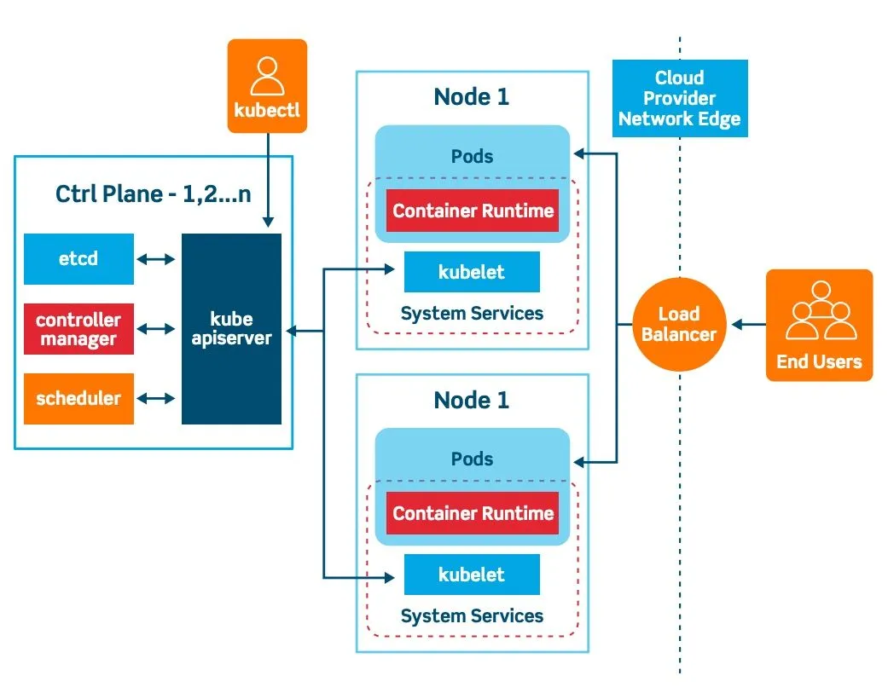

<div class="slide-title">

# Go + Flutter Course
## CI/CD & Deployment

**Timur Harin**  
Lecture 07: **CI/CD & Deployment**

</br>

*From code to production: Automated delivery pipelines*

</div>

---

# Block 7: CI/CD & Deployment

<div class="slide-content">

## Lecture 07 Overview
- **Build Fundamentals**: Understanding compilation and build processes
- **CI/CD Pipelines**: Automated testing, building, and deployment
- **Containerization**: Docker for Go and Flutter applications
- **Orchestration**: Kubernetes deployment and management
- **Store Deployment**: Publishing to app stores and web platforms

## What we'll learn
- **Build processes for Go binaries and Flutter apps**
- **Setting up comprehensive CI/CD pipelines**
- **Container best practices and multi-stage builds**
- **Kubernetes deployment strategies and configurations**
- **App store publishing and web deployment**
- **Monitoring and rollback strategies**

</div>

---

# Learning path

<div class="slide-content">

```
Build & Deployment Fundamentals
       |
       ├── Go Build Process ───────────┐
       |                               |
       ├── Flutter Build Process ──────┤
       |                               |
       ├── CI/CD Pipeline Setup ───────┤
       |                               |
       ├── Containerization ───────────┤
       |                               |
       └── Orchestration & Monitoring ─┤
                                       |
                                       ▼
                        Production-Ready Deployment
```

- **Foundation**: Understanding build processes and artifacts
- **Automation**: CI/CD pipelines for consistent delivery
- **Containerization**: Packaging applications for deployment
- **Orchestration**: Managing applications at scale

</div>

---

# Part I: Build Fundamentals

<div class="slide-content">

> **Build processes** transform source code into executable artifacts that can run on target platforms.

#### Build pipeline stages
1. **Source Code**: Version-controlled application code
2. **Dependencies**: Package management and dependency resolution
3. **Compilation**: Transform source to binary/bytecode
4. **Testing**: Automated quality assurance
5. **Packaging**: Bundle into deployable artifacts
6. **Distribution**: Deliver to target environments

#### Key concepts
- **Cross-compilation**: Building for different platforms
- **Build artifacts**: Output files from build process
- **Build tools**: Compilers, bundlers, package managers
- **Environment consistency**: Reproducible builds

</div>

---

# Go build fundamentals

<div class="slide-content">

<div class="code-columns">
<div>

#### Basic Go compilation
```bash
# Build for current platform
go build -o myapp ./cmd/server

# Build with specific module
go build -o myapp github.com/user/repo/cmd/server

# Build with version information
go build -ldflags "-X main.version=1.0.0" -o myapp

# Optimize for production
go build -ldflags "-s -w" -o myapp
# -s: strip symbol table
# -w: strip debug information
```

</div>

<div>

#### Cross-platform compilation
```bash
# Build for Linux
GOOS=linux GOARCH=amd64 go build -o myapp-linux

# Build for Windows
GOOS=windows GOARCH=amd64 go build -o myapp.exe

# Build for macOS (Intel)
GOOS=darwin GOARCH=amd64 go build -o myapp-darwin

# Build for macOS (Apple Silicon)
GOOS=darwin GOARCH=arm64 go build -o myapp-darwin-arm64

# List all supported platforms
go tool dist list
```

</div>

</div>

</div>

---

# Go build optimization

<div class="slide-content">

<div class="code-columns">
<div>

#### Build script example (build.sh)
```bash
#!/bin/bash
VERSION=$(git describe --tags --always)
BUILD_TIME=$(date -u '+%Y-%m-%d_%H:%M:%S')
COMMIT_HASH=$(git rev-parse HEAD)
LDFLAGS="-s -w \
  -X main.version=${VERSION} \
  -X main.buildTime=${BUILD_TIME} \
  -X main.commitHash=${COMMIT_HASH}"
echo "Building version: ${VERSION}"

# Build for multiple platforms
platforms=("linux/amd64" "darwin/amd64" "windows/amd64") # can have more
for platform in "${platforms[@]}"; do
  GOOS=${platform%/*}
  GOARCH=${platform#*/}
  output="dist/myapp-${GOOS}-${GOARCH}"
  if [ "$GOOS" = "windows" ]; then
    output+=".exe"
  fi
  GOOS=$GOOS GOARCH=$GOARCH go build \
    -ldflags "${LDFLAGS}" \
    -o "$output" ./cmd/server
  echo "Built: $output"
done
```

</div>

<div>

#### Version information injection
```go
// cmd/server/main.go
package main
import (
    "fmt"
    "log"
    "runtime"
)
var (
    version    string = "dev"
    buildTime  string = "unknown"
    commitHash string = "unknown"
)
func main() {
    fmt.Printf("App Version: %s\n", version)
    fmt.Printf("Build Time: %s\n", buildTime)
    fmt.Printf("Commit: %s\n", commitHash)
    fmt.Printf("Go Version: %s\n", runtime.Version())
    fmt.Printf("Platform: %s/%s\n", runtime.GOOS, runtime.GOARCH)  
    // Start your application
    startServer()
}
```

</div>

</div>

</div>

---

# Flutter build fundamentals

<div class="slide-content">

<div class="code-columns">
<div>

#### Build modes
```bash
# Debug mode (development)
flutter run  # Hot reload enabled
flutter build apk --debug

# Profile mode (performance testing)
flutter build apk --profile
flutter run --profile

# Release mode (production)
flutter build apk --release
flutter build appbundle --release  # For Play Store
flutter build ios --release
flutter build web --release
```

</div>

<div>


#### Platform-specific builds
```bash
# Android
flutter build apk --split-per-abi  # Multiple APKs
flutter build appbundle           # App Bundle (recommended)

# iOS
flutter build ios --release --no-codesign
flutter build ipa                 # For App Store

# Web
flutter build web --web-renderer html  # HTML renderer
flutter build web --web-renderer canvaskit  # CanvasKit
```

</div>

</div>

</div>

---

# Flutter build flavors

<div class="slide-content">

<div class="code-columns">

<div>

#### Build configuration
```yaml
# pubspec.yaml
flutter:
  uses-material-design: true
  assets:
    - assets/images/
    - assets/configs/
# Build flavors
flutter:
  flavors:
    development:
      android:
        applicationId: "com.example.app.dev"
      ios:
        bundleId: "com.example.app.dev"
    production:
      android:
        applicationId: "com.example.app"
      ios:
        bundleId: "com.example.app"
```

</div>

<div>

#### Build flavors
```bash
# Build with flavor
flutter build apk --flavor development
flutter build apk --flavor production --release
```

</div>

</div>

</div>

---

# Go build artifacts and versioning

<div class="slide-content">

<div class="code-columns">
<div>

#### Go build artifacts
```
dist/
├── myapp-linux-amd64           # Linux binary
├── myapp-darwin-amd64          # macOS Intel binary
├── myapp-darwin-arm64          # macOS ARM binary
├── myapp-windows-amd64.exe     # Windows binary
├── checksums.sha256            # Integrity verification
└── release-notes.md            # Version information
```

</div>

<div>

#### Makefile for consistent builds
```makefile
VERSION := $(shell git describe --tags --always)
LDFLAGS := -s -w -X main.version=$(VERSION)

.PHONY: build
build:
	go build -ldflags "$(LDFLAGS)" -o bin/myapp ./cmd/server
.PHONY: build-all
build-all:
	GOOS=linux GOARCH=amd64 go build -ldflags "$(LDFLAGS)" 
    -o dist/myapp-linux ./cmd/server
	GOOS=darwin GOARCH=amd64 go build -ldflags "$(LDFLAGS)" 
    -o dist/myapp-darwin ./cmd/server
	GOOS=windows GOARCH=amd64 go build -ldflags "$(LDFLAGS)" 
    -o dist/myapp.exe ./cmd/server
.PHONY: test
test:
	go test -v ./...
.PHONY: clean
clean:
	rm -rf dist/ bin/
```

</div>

</div>

</div>


---

# Flutter version management

<div class="slide-content">

<div class="code-columns">
<div>


```yaml
# pubspec.yaml
name: myapp
description: My Flutter application
version: 1.2.3+4  # semantic version + build number

environment:
  sdk: ">=3.0.0 <4.0.0"
  flutter: ">=3.10.0"
```

</div>

<div>

```dart
// lib/config/app_config.dart
class AppConfig {
  static const String appName = 'MyApp';
  static const String version = String.fromEnvironment(
    'APP_VERSION',
    defaultValue: '1.0.0',
  );
  static const String buildNumber = String.fromEnvironment(
    'BUILD_NUMBER',
    defaultValue: '1',
  );
  static const String environment = String.fromEnvironment(
    'ENVIRONMENT',
    defaultValue: 'development',
  );
}
```

</div>

</div>

</div>

---

# Part II: CI/CD Pipeline Setup

<div class="slide-content">

> **Continuous Integration/Continuous Deployment** automates the software delivery process, ensuring quality and enabling rapid, reliable releases.

#### CI/CD benefits
- **Automated testing**: Catch bugs early and consistently
- **Consistent builds**: Same process every time
- **Fast feedback**: Quick detection of issues
- **Reduced manual work**: Less human error
- **Faster releases**: Deploy frequently with confidence

#### Popular CI/CD platforms
- **GitHub Actions**: Integrated with GitHub repositories
- **GitLab CI/CD**: Built into GitLab platform
- **Jenkins**: Self-hosted, highly customizable
- **Azure DevOps**: Microsoft's complete DevOps platform

</div>

---

<div class="slide-content">

<div class="code-columns">
<div>

#### Typical steps for Go
1.**Checkout code**: Retrieve source from version control
2.**Set up Go environment**: Install Go toolchain and dependencies
3.**Dependency caching**: Speed up builds by caching modules
4.**Static analysis**: Run `go vet`, `golint`, or similar tools
5.**Run tests**: Execute unit/integration tests with coverage
6.**Build binaries**: Compile for target platforms (cross-compile if needed)
7.**Security checks**: Scan for vulnerabilities (e.g., `gosec`)
8.**Build Docker image**: Package app for deployment
9.**Publish artifacts**: Upload binaries/images to registry or storage
10.**Deploy**: Roll out to staging/production environments

</div>

<div>

#### Typical steps for Flutter
1.**Checkout code**: Retrieve source from version control
2.**Set up Flutter environment**: Install Flutter SDK and dependencies
3.**Dependency caching**: Cache `pub` packages
4.**Static analysis**: Run `flutter analyze` for code quality
5.**Run tests**: Execute widget/unit/integration tests with coverage
6.**Build artifacts**: Generate APK, AAB, IPA, or web assets
7.**Code signing**: Apply signing keys/certificates for release builds
8.**Build Docker image** (for web): Package static assets with Nginx
9.**Publish artifacts**: Upload to Play Store, App Store, or web/CDN
10.**Deploy**: Release to users or hosting platforms

</div>

</div>

</div>

---

# Part III: Containerization

<div class="slide-content">

> **Docker containers** provide consistent, portable deployment environments by packaging applications with their dependencies.

#### Container benefits
- **Consistency**: Same environment everywhere
- **Isolation**: Applications don't interfere with each other
- **Portability**: Run anywhere Docker is supported
- **Scalability**: Easy to scale up/down
- **Resource efficiency**: Lower overhead than VMs

#### Docker concepts
- **Image**: Read-only template for creating containers
- **Container**: Running instance of an image
- **Dockerfile**: Instructions for building images
- **Registry**: Repository for storing and sharing images

</div>

---

# Docker for Go applications

<div class="slide-content">

<div class="code-columns">
<div>

#### Basic Dockerfile
```dockerfile
# Dockerfile
FROM golang:1.21-alpine AS builder
WORKDIR /app
COPY go.mod go.sum ./
RUN go mod download
COPY . .
RUN CGO_ENABLED=0 GOOS=linux go build \
    -ldflags "-s -w" \
    -o main ./cmd/server

FROM alpine:latest
RUN apk --no-cache add ca-certificates tzdata
WORKDIR /root/
COPY --from=builder /app/main .
EXPOSE 8080
CMD ["./main"]
```

</div>

<div>

#### Multi-stage optimized build
```dockerfile
# Dockerfile.optimized
FROM golang:1.21-alpine AS builder
# Install git for private modules
RUN apk add --no-cache git
WORKDIR /app
# Copy dependency files first for better caching
COPY go.mod go.sum ./
RUN go mod download
# Copy source code
COPY . .
# Build the binary
RUN CGO_ENABLED=0 GOOS=linux GOARCH=amd64 go build \
    -ldflags="-w -s -X main.version=${VERSION}" -a -installsuffix cgo -o \
    main ./cmd/server
# Final stage
FROM scratch
# Add CA certificates for HTTPS
COPY --from=builder /etc/ssl/certs/ca-certificates.crt /etc/ssl/certs/
# Add timezone data
COPY --from=builder /usr/share/zoneinfo /usr/share/zoneinfo
# Add binary
COPY --from=builder /app/main /main
EXPOSE 8080
ENTRYPOINT ["/main"]
```

</div>

</div>

</div>

---

# Docker for Flutter Web

<div class="slide-content">

<div class="code-columns">
<div>

#### Flutter web Dockerfile
```dockerfile
# Dockerfile.flutter-web
FROM cirrusci/flutter:stable AS builder

WORKDIR /app
COPY pubspec.* ./
RUN flutter pub get

COPY . .
RUN flutter build web --release

FROM nginx:alpine
COPY --from=builder /app/build/web /usr/share/nginx/html

# Custom nginx configuration
COPY nginx.conf /etc/nginx/nginx.conf

EXPOSE 80
CMD ["nginx", "-g", "daemon off;"]
```

</div>

<div>

#### Nginx configuration
```nginx
# nginx.conf
events {
    worker_connections 1024;
}

http {
    include       /etc/nginx/mime.types;
    default_type  application/octet-stream;
    
    gzip on;
    gzip_vary on;
    gzip_min_length 1024;
    gzip_types text/plain text/css application/json application/javascript text/xml application/xml 
      application/xml+rss text/javascript;

    server {
        listen 80;
        server_name localhost;
        root /usr/share/nginx/html;
        index index.html;

        # Handle Flutter routing
        location / {
            try_files $uri $uri/ /index.html;
        }
        
        # Cache static assets
        location ~* \.(js|css|png|jpg|jpeg|gif|ico|svg|woff|woff2)$ {
            expires 1y;
            add_header Cache-Control "public, immutable";
        }
    }
}
```

</div>

</div>

</div>

---

# Docker Compose for development

<div class="slide-content">

<div class="code-columns">
<div>

#### Frontend service
```yaml
# docker-compose.yml
version: '3.8'

services:
  frontend:
    build:
      context: ./frontend
      dockerfile: Dockerfile.dev
    ports:
      - "3000:3000"
    volumes:
      - ./frontend:/app
      - node_modules:/app/node_modules
    environment:
      - API_URL=http://backend:8080
    restart: unless-stopped
```

</div>

<div>

#### Backend service
```yaml
  backend:
    build:
      context: ./backend
      dockerfile: Dockerfile.dev
    ports:
      - "8080:8080"
    environment:
      - DB_HOST=postgres
      - DB_NAME=myapp_dev
      - DB_USER=postgres
      - DB_PASSWORD=password
      - REDIS_URL=redis:6379
    volumes:
      - ./backend:/app
      - go_modules:/go/pkg/mod
    depends_on:
      - postgres
      - redis
    restart: unless-stopped
```

</div>

</div>

</div>

---

# Docker Compose for development

<div class="slide-content">

<div class="code-columns">
<div>

#### Database and cache
```yaml
  postgres:
    image: postgres:15-alpine
    environment:
      - POSTGRES_DB=myapp_dev
      - POSTGRES_USER=postgres
      - POSTGRES_PASSWORD=password
    volumes:
      - postgres_data:/var/lib/postgresql/data
      - ./backend/migrations:/docker-entrypoint-initdb.d
    ports:
      - "5432:5432"
    restart: unless-stopped

  redis:
    image: redis:7-alpine
    ports:
      - "6379:6379"
    volumes:
      - redis_data:/data
    restart: unless-stopped
```

</div>

<div>

#### Nginx and volumes
```yaml
  nginx:
    image: nginx:alpine
    ports:
      - "80:80"
    volumes:
      - ./nginx.conf:/etc/nginx/nginx.conf
    depends_on:
      - backend
      - frontend
    restart: unless-stopped

volumes:
  postgres_data:
  redis_data:
  go_modules:
  node_modules:
```

</div>

</div>

</div>

---

# Container best practices

<div class="slide-content">

<div class="code-columns">
<div>

#### Security best practices
```dockerfile
# Use specific version tags
FROM golang:1.21.4-alpine3.18

# Create non-root user
RUN addgroup -g 1001 -S appgroup && \
    adduser -u 1001 -S appuser -G appgroup

# Install only necessary packages
RUN apk add --no-cache ca-certificates tzdata

# Use non-root user
USER appuser

# Set read-only filesystem
COPY --chown=appuser:appgroup --from=builder /app/main /main

# Health check
HEALTHCHECK --interval=30s --timeout=3s --start-period=5s --retries=3 \
  CMD wget --no-verbose --tries=1 \
    --spider http://localhost:8080/health || exit 1
```

</div>

<div>

#### Performance optimization
```dockerfile
# Minimize layers
RUN apk add --no-cache \
    ca-certificates \
    tzdata \
    && rm -rf /var/cache/apk/*

# Use .dockerignore
.git
.gitignore
Dockerfile*
docker-compose*
.dockerignore
.env*
coverage.txt
*.md
tests/
.github/
```

</div>

</div>

</div>

---

# Part IV: Kubernetes Deployment

<div class="slide-content">

> **Kubernetes** orchestrates containerized applications at scale, providing automated deployment, scaling, and management.

#### Kubernetes core concepts
- **Pod**: Smallest deployable unit (one or more containers)
- **Deployment**: Manages replica sets and rolling updates
- **Service**: Network endpoint for accessing pods
- **ConfigMap**: Configuration data storage
- **Secret**: Sensitive data storage
- **Ingress**: External access management

#### Benefits
- **Self-healing**: Automatic pod replacement and health monitoring
- **Scaling**: Horizontal and vertical pod autoscaling
- **Rolling updates**: Zero-downtime deployments
- **Service discovery**: Built-in load balancing and networking

</div>

---


<style scoped>
img {
  max-height: 600px !important;
  max-width: 90% !important;
  object-fit: contain !important;
  margin: 0 auto !important;
  display: block !important;
}
</style>



---

<style scoped>
img {
  max-height: 600px !important;
  max-width: 90% !important;
  object-fit: contain !important;
  margin: 0 auto !important;
  display: block !important;
}
</style>


---

# Part V: App Store Deployment

<div class="slide-content">

> **App store deployment** involves specific requirements, code signing, and review processes for different platforms.

#### Platform requirements

| Platform | Format | Requirements |
|----------|---------|-------------|
| **Google Play** | AAB/APK | Google Play Console account, signing key |
| **Apple App Store** | IPA | Apple Developer account, certificates |
| **Web Hosting** | Static files | Domain, SSL certificate |
| **Microsoft Store** | MSIX | Microsoft Partner Center account |

- **Code signing**: Cryptographic verification of app authenticity
- **App review**: Platform-specific guidelines and approval process
- **Release management**: Staged rollouts and version control
- **Metadata**: App descriptions, screenshots, privacy policy

</div>


---

# What we've learned

<div class="slide-content">

## Build Fundamentals
- **Go compilation**: Cross-platform builds and optimization techniques
- **Flutter builds**: Platform-specific artifacts and build modes
- **Version management**: Embedding build information and semantic versioning
- **Build automation**: Makefiles and scripts for consistent builds

## CI/CD Pipelines
- **Plan**: What are popular steps?
- **Platforms**: GitHub Actions, GitLab CI/CD, Jenkins, CircleCI, Azure DevOps
- **Conditional deployment**: Environment-specific release strategies

</div>

---

# What we've learned (continued)

<div class="slide-content">

## Containerization
- **Docker fundamentals**: Images, containers, and multi-stage builds
- **Go containerization**: Optimized Docker images with scratch base
- **Flutter web**: Nginx-based container deployment
- **Best practices**: Security, optimization, and health checks

## Kubernetes Orchestration
- **Core concepts**: Pods, Deployments, Services, and Ingress
- **Scaling**: Horizontal Pod Autoscaler and resource management

## App Store Deployment
- **Main steps**:What is the flow?

</div>

---

# Thank You!

<div class="slide-content">

**What's Next:**
- Lab 07: Implement complete CI/CD pipeline for your project

**Resources:**
- Docker Best Practices: https://docs.docker.com/develop/dev-best-practices/
- Kubernetes Documentation: https://kubernetes.io/docs/
- GitHub Actions: https://docs.github.com/en/actions
- Flutter Deployment: https://docs.flutter.dev/deployment
- Course Repository: https://github.com/timur-harin/sum25-go-flutter-course

**Contact:**
- Email: timur.harin@mail.com
- Telegram: @timur_harin

**Next Lecture:** Final Project & Wrap-up

## Questions?

</div> 